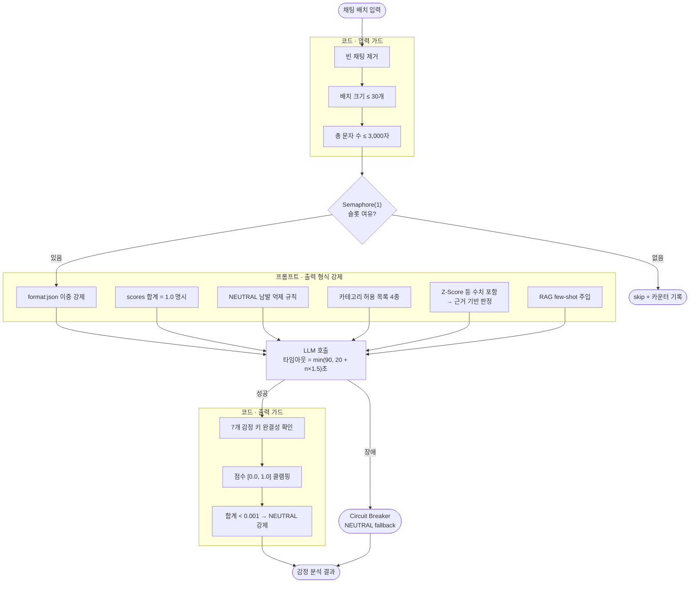

# 각(Gak) — 치지직 스트리머용 VOD 하이라이트 추출 및 방송 도구
  
기간 : 2026.02.25 ~ 2026.05.18
  

치지직 스트리머용 VOD 편집 후보 구간을 자동으로 추출 기능과 투표·룰렛 등 라이브 방송 보조 기능을 제공합니다.

---

## 미리보기

### VOD 하이라이트 추출
<!-- vod 하이라이트 추천 기능 이미지 -->
<br/>
<p align="center">
  
</p>
<br/>

### 민심 체크
<!-- 민심 체크 기능 이미지 -->
<br/>
<p align="center">
  
  </br>
  
</p>
<br/>

---

## ✨ 앱 플로우 소개

|  🔐 로그인  |  🎬 VOD 하이라이트  |  🎯 투표  | 🎯 룰렛 | 💬 민심 |
|:---:|:---:|:---:| :---:| :---:|
|  |  |  |  |  |
| CHZZK OAuth 로그인 | 편집 후보 구간 자동 선별 | 채팅 기반 투표 | 도네이션 룰렛 | 실시간 민심 체크 |

---

## 🚀 핵심 기능

### 🔒 인증 & 보안
- CHZZK OAuth 로그인
- HMAC-SHA256 서명 + Redis 세션 바인딩으로 즉시 토큰 revocation

### 💬 채팅 관련 기능
- 투표 명령(`!투표 N`)을 통해 투표 및 룰렛 기능을 제공합니다.

### 🎬 VOD 분석 & 하이라이트
- `채팅 빈도`, `분위기 변환` 기반 편집 후보 선별
- 시간대 버킷 분산을 이용한 앞쪽 쏠림 방지
- **감정 분류 7 레이블** — `JOY` · `HOPE` · `WONDER` · `HYPE` · `SADNESS` · `ANGER` · `DISGUST`  
  `NEUTRAL`은 두 가지 의미로 쓰입니다. ① 어느 레이블도 우세하지 않은 채팅의 결과값, ② LLM 장애·검증 실패 시 시스템이 강제 할당하는 안전 기본값 — "감정 없음"이 아니라 "판단 불가 또는 복구 상태"입니다.

### 🎯 투표 & 룰렛
- 실시간 투표 — 시작·중지 분리, 채팅 기록 모달 제공
- 도네이션 금액 비례 가중 룰렛

---

## 🏗️ 아키텍처

```
Browser
  └─ Next.js (3000)              ← UI + API Proxy
       ├─ /api/chzzk/*  →  collector (8081)   ← 로그인, 채팅 수집, VOD 크롤링
       └─ /api/v1/*     →  core-api  (8083)   ← 분석 결과, SSE, 접근 제어

  collector (8081)                  analyzer (8082)                core-api (8083)
  채팅 수집 · VOD 크롤링  ─Kafka─►  감정 분석 · 편집 후보 계산  ─Kafka─►  저장 · SSE · 접근 제어
        │                                                                  │
        │◄──────── vod-analysis-complete/failed-topic ──────────────────────┤
        │                                                                  │
        │                                                             PostgreSQL (pgvector)
        │                                                             Redis  ← 세션, 실시간 집계
```

---

## ⚡ 핵심 챌린지

### LLM 출력 품질 가드레일
LLM이 반환하는 감정 분석 JSON은 필드 누락·범위 초과·zero-score 뭉침 등 비결정적 실패가 빈번합니다. 코드 레벨 방어와 프롬프트 레벨 강제를 함께 적용했습니다.

**코드 레벨 — 3단계 가드**

| 단계 | 처리 |
|------|------|
| 입력 정제 | 빈 채팅 제거 → 배치 크기 상한(30개) → 총 문자 상한(3,000자) |
| 출력 검증 | 감정 키 7개 전부 분석 완료됐는지 확인 → 미분석 점수 클램핑 → 전 필드 0.0이면 `NEUTRAL` 강제 치환 |
| 동시성 제어 | `Semaphore` + 채팅 배치에 따라 동적 타임아웃 적용 |

**프롬프트 제약 — `resources/prompts/` 템플릿 파일에 직접 명시**

코드 레벨의 가드레일은 잘못된 출력을 사후 교정합니다. 
LLM이 잘못된 형식을 반환하지 않도록 Ollama 호출 시 주입하는 프롬프트 템플릿 파일에 다음 규칙을 직접 작성했습니다.

- **JSON 출력 강제**: Ollama API의 `format: "json"` 옵션과 시스템 프롬프트의 "출력은 반드시 JSON만 반환할 것" 규칙을 이중으로 적용
- **점수 합계 1.0 명시**: 시스템 프롬프트에 "각 messageId의 scores 합계는 반드시 1.0이어야 한다" 규칙 추가 — 코드 클램핑 이전에 LLM 스스로 비율로 분배하도록 유도
- **NEUTRAL 남발 억제**: "가능하면 NEUTRAL 남발을 피하고, 가장 지배적인 감정을 분명하게 분류할 것" — zero-score 뭉침의 근본 원인을 프롬프트 단에서 억제
- **할루시네이션 방지**: "제공된 채팅에 실제로 등장한 표현만 키워드로 추출할 것. 없는 키워드는 만들지 말 것"
- **하이라이트 판정 페르소나**: "10만 구독자를 보유한 게임 하이라이트 채널의 전문 편집자" 역할 부여 — 편집 기준에서 판단하도록 유도
- **카테고리 허용 목록**: `슈퍼플레이/대참사/운/소통` 4가지로 제한해 임의 카테고리 생성 방지
- **수치 근거 강제**: 유저 프롬프트에 Z-Score·densityRatio·laughRatio 등 정량 지표를 포함시켜 LLM이 텍스트 인상이 아닌 수치 기반으로 판정하도록 구성
- **RAG few-shot 주입**: 과거 승인·거절된 하이라이트 사례를 검색해 프롬프트에 삽입



가드레일 적용 전에는 응답 JSON 파싱 실패 시 전체 배치가 드롭되거나 zero-score 뭉침으로 모든 채팅의 감정이 NEUTRAL(중립)로 집계되는 문제가 있었습니다.

### 채팅 패턴 기반 하이라이트 추출
pgvector는 VOD 하이라이트 RAG(few-shot 유사 구간 검색)용으로 먼저 도입했습니다. 초기에는 SQL 레벨 점수 정렬로도 대체할 수 있는 수준이었으나, **실시간 유사 하이라이트 알림** 기능을 추가하면서 벡터 검색이 필수가 되었습니다.

라이브 채팅 패턴(EMA 스파이크 + 키워드 + 앵커 채팅)을 임베딩해 과거 하이라이트와 cosine 유사도를 비교하는 작업은 SQL 집계로 표현할 수 없었습니다.  
스파이크 감지 → 임베딩 생성 → pgvector 검색 → SSE push 전 경로를 비동기 reactive chain으로 구성해, 유사 하이라이트 알림 실패가 메인 `v2_frame` 전송 경로에 영향을 주지 않도록 격리했습니다.

### 분산 시스템 설계
VOD 동시성 제한을 in-memory가 아닌 **Redis 카운터 + TTL**로 설계해 수평 확장 가능성을 확보했습니다. Kafka 파티션 키를 스트리머 방송별 id로 설정해 방별 메시지 순서를 보장했습니다.

### fail-open vs fail-secure
Redis 장애 상황에서 **인증은 차단(fail-secure)**, **VOD 슬롯 카운팅은 허용(fail-open)**으로 보호 대상에 따라 장애 전략을 다르게 설계했습니다.

---

## 🤖 AI 개발 워크플로우

### Plan-First + Human Approval Gate
AI가 코드를 수정하기 전에 반드시 변경 범위·영향 파일·대안을 정리한 계획을 먼저 제출하고 사람의 승인을 받도록 강제합니다.

- `EnterPlanMode` → 구현 계획 작성 → `ExitPlanMode`(사람 승인) 순서를 `CLAUDE.md` 규칙으로 고정
- 승인 전 파일 수정 불가 — AI가 의도치 않은 파일을 건드리거나 작업 범위를 벗어나는 상황을 사전 차단
- 주요 변경은 `docs/design/` 에 번호 붙은 설계 문서로 남겨 결정 맥락을 보존

### Researcher / Planner / Reviewer 독립 에이전트
탐색·설계·검토 세 단계를 **별개의 Claude API 호출**로 분리해 각 에이전트가 독립된 컨텍스트와 제한된 툴셋으로 동작합니다.

```
Researcher  ─(보고서)→  Planner  ─(계획서)→  Reviewer  ─(판정)→  구현
읽기 전용               툴 없음              읽기 전용
```

- **Researcher** — `read_file` / `list_directory` / `grep_code` 만 사용, 파일 수정 불가
- **Planner** — 탐색 결과를 받아 단계별 구현 계획·위험 요소·롤백 전략 작성
- **Reviewer** — 계획서와 실제 코드를 대조해 🔴🟡🟢 리스크 평가 후 ✅/⚠️/❌ 판정
- Claude Code에서 `/workflow "작업 설명"` 으로 즉시 실행 (`scripts/run_workflow.py`)

### Prompt & Logging Hook
에이전트 실행 전 과정을 파일로 기록해 재현성을 확보하고 오류 원인 추적을 가능하게 합니다.

실행마다 `workflow_logs/<timestamp>_<run_id>/` 에 저장:

| 파일 | 내용 |
|------|------|
| `events.jsonl` | 전체 이벤트 스트림 — API 호출·툴 호출·에러·토큰 수 (기계 파싱용) |
| `prompts/*.txt` | 각 에이전트에 전달된 **정확한 시스템 프롬프트 + 유저 메시지** (재현용) |
| `summary.md` | 에이전트별 반복 횟수·소요 시간·토큰 합계·툴 호출 내역 요약 |

---

## 🛠️ 기술 스택

| 영역 | 기술 |
|------|------|
| Frontend | Next.js 15, TypeScript, Tailwind CSS |
| Backend | Spring Boot (WebFlux), Java 17 |
| 메시지 브로커 | Apache Kafka |
| 캐시·세션 | Redis 7 |
| DB | PostgreSQL 15 + pgvector |
| LLM | Ollama — `nomic-embed-text`, 감정 분석 모델 |
| 인프라 | Docker Compose, Resilience4j Circuit Breaker |

---

## 💻 로컬 실행

### 사전 준비
- Docker Desktop, JDK 17, Node.js
- `backend/.env` — CHZZK OAuth 키 포함

```env
CHZZK_CLIENT_ID=...
CHZZK_CLIENT_SECRET=...
GAK_OWNER_TOKEN_SECRET=...
GAK_INTERNAL_API_SECRET=...
GAK_COOKIE_SECURE=false
```

### 실행 순서

```bash
# 1. 인프라 (PostgreSQL, Redis, Kafka)
cd backend && docker compose up -d

# 2. 백엔드 서비스 (순서 중요)
./gradlew :core-api:bootRun
./gradlew :analyzer:bootRun
./gradlew :collector:bootRun

# 3. 프론트엔드
cd frontend && npm install && npm run dev
```

브라우저에서 `http://localhost:3000` 접속 후 로그인하면 본인 채널 대시보드로 진입합니다.

### Mock 데이터 주입 (방송 없이 테스트)

```bash
# 채팅 주입
curl -X POST "http://localhost:8081/api/v1/dev/mock-chat/{channelId}?count=10"

# 도네이션·투표 데이터
curl -X POST "http://localhost:8083/dev/seed/{channelId}"
```

---

## 🔧 주요 트러블슈팅

| 문제 | 원인 | 해결 |
|------|------|------|
| `${CHZZK_CLIENT_ID}` URL 노출 | `.env`가 Spring에 미로드 | `application.yaml`에 `spring.config.import` 추가 |
| CORS 에러처럼 보이는 preflight 차단 | 검증 필터가 `OPTIONS` 요청을 막음 | 반드시 **Next.js API proxy 경유** 요청 |
| VOD 분석이 `ANALYZING`에서 멈춤 | 이벤트 체인이 끊겨 상태 전이 불발 | analyzer 로그 → consumer group 구독 확인 |
| 하이라이트가 앞쪽에만 몰림 | 초반 채팅 밀도가 점수 독점 | 시간대 버킷 분산 + `transitionScore` 가중치 조정 |
| 로컬 PostgreSQL 포트 충돌 (5432) | Docker와 로컬 PG 동시 실행 | 로컬 PG 중지 후 `docker ps`로 컨테이너 확인 |


---

## 🏷️ 바로가기

| 문서 | 설명 |
|------|------|
| [프로젝트 개요](docs/design/00_project_overview.md) | VOD 하이라이트 추출 목적·AI 통합 방식·POC 검증·기술 스택 선택 근거 |
| [아키텍처 결정 기록 (ADR)](docs/design/01_ADR.md) | Kafka·WebFlux·pgvector 등 주요 기술 결정과 트레이드오프 |
| [LLM 가드레일 설계](docs/design/18_llm_guardrail_plan.md) | 입출력 가드레일·동시성 제어·VOD 슬롯 제한 구현 기록 |
| [VOD 하이라이트 흐름도](docs/design/26_vod_highlight_sequence_diagrams.md) | 분석 요청부터 결과 저장까지 6단계 Mermaid 시퀀스 다이어그램 |
| [ERD](docs/design/27_erd.md) | 전체 테이블 구조 및 pgvector 임베딩 컬럼 설명 |
| [시스템 신뢰성 설계](docs/design/30_system_reliability.md) | 재시도·Circuit Breaker·fail-open/secure 전략 |
| [온보딩 가이드](docs/design/29_onboarding_guide.md) | 로컬 실행·인증 흐름·코드 탐색 가이드 |
