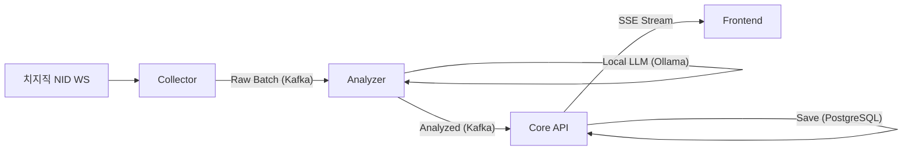

# Project [늘:Neul] 프로젝트 기능 명세 및 인수인계 보고서

> **최종 버전:** v1.0 (2026-03-29)  
> **프로젝트 성격:** 실시간 방송 채팅 감정 분석 및 하이라이트 감지 플랫폼

---

## 1. 프로젝트 개요 (Overview)

"늘(Neul)" 프로젝트는 실시간 스트리밍 환경에서 발생하는 방대한 채팅 데이터를 실시간으로 수집, 분석하여 **방송의 흐름(민심)을 시각화**하고, 결정적인 순간(**하이라이트**)을 자동으로 감지하는 플랫폼입니다.

### 🎯 핵심 목적
- **실시간 여론 분석**: 2초 단위의 고속 분석을 통해 현재 시청자들의 반응을 즉각적으로 파악.
- **하이라이트 자동 생성**: 감정 스파이크를 감지하여 방송 후 다시 보기 및 쇼츠 제작을 위한 메타데이터 제공.
- **고성능 처리**: 수만 명의 시청자가 참여하는 대규모 채널에서도 지연 없는 데이터 파이프라인 유지.

---

## 2. 시스템 아키텍처 및 데이터 흐름

1. **Collector**: 치지직 웹소켓(NID Chat)에 연결하여 2초 단위로 채팅을 묶어 Kafka(`raw-chat-topic`)로 전송합니다.
2. **Analyzer**: Kafka를 소비하여 Ollama(Llama3) 엔진을 통해 7가지 감정 점수를 산출하고 다시 Kafka(`analyzed-chat-topic`)로 발행합니다.
3. **Core API**: 최종 분석 데이터를 소비하여 실시간 통계(Redis)와 이력(DB)을 관리하며, 프론트엔드에 SSE(Server-Sent Events)로 푸시합니다.
4. **Frontend**: Next.js 기반 대시보드에서 차트와 하이라이트 보드를 통해 사용자에게 시각화된 정보를 제공합니다.

---

## 3. 핵심 기술 명세 (Technical Specs)

### ✅ 실시간 고속 수집 (Collector)
- **프로토콜**: 치지직 내부 웹소켓(NID Chat) 직접 연동 (공식 API 대비 속도 및 누락 방지).
- **마이크로배칭**: **2초 단위(`window(Duration.ofSeconds(2))`)**로 채팅을 묶어 처리 효율 극대화.
- **최적화**: JNI(`NativeBridge`) 기반의 채팅 전처리/필터링 구조 준비 완료.

### ✅ 감정 분석 모델 (Analyzer)
- **엔진**: Local LLM (Ollama / Llama3) 기반.
- **감정 분류 (7종)**: `JOY`, `HOPE`, `NEUTRAL`, `SADNESS`, `ANGER`, `WONDER`, `DISGUST`.
- **최적화 전략**: 동일한 내용의 채팅을 압축(`CompressedChat`)하여 LLM 호출 횟수 및 비용 절감.

### ✅ 하이라이트 감지 엔진 (Core API)
- **방식**: **상대적 스파이크 감지 (Relative Spike Detection)**.
- **로직**: 최근 1분간의 평균 감정 강도 대비 특정 시점의 강도가 **1.5배 이상 스파이크**될 경우 하이라이트로 판정.
- **부가 기능**: 감지 시점의 라이브 썸네일을 자동으로 캡처하여 메타데이터와 함께 저장.

---

## 4. 진척도 및 구현 현황 (Implementation Status)

| 모듈 | 기능 | 상태 | 비고 |
| :--- | :--- | :---: | :--- |
| **Collector** | NID 웹소켓 수집기 | ✅ | 2초 배칭 적용 완료 |
| | NativeBridge (JNI) | 🏗️ | Rust 연동 대기 (Stub 상태) |
| **Analyzer** | Ollama 7종 감정 분석 | ✅ | JSON 포맷 출력 최적화 완료 |
| | Gemini 하이브리드 요약 | ⏳ | 상황 요약 기능 추가 예정 |
| **Core API** | SSE 실시간 스트림 | ✅ | Multicast/Replay 적용 완료 |
| | 하이라이트 감지 로직 | ✅ | 상대적 스파이크 알고리즘 구현 |
| | 투표/집계 서비스 | ✅ | Redis 기반 실시간 집계 |
| **Frontend** | 라이브 대시보드 UI | ✅ | 감정 히트맵, 민심 미터기 구현 |
| | 하이라이트 보드 | ✅ | 썸네일 매핑 완료 |

---

## 5. 주요 스펙 변경 이력 (Pivots & Changes)

- **[2026-03-05] API 방식 변경**: 공식 API의 속도 제한 문제로 인해 브라우저 내부 웹소켓(NID Chat) 수집 방식으로 전면 전환.
- **[2026-03-14] 처리 단위 고도화**: 실시간성 강화를 위해 기존 1분 단위 배치를 **2초 단위 마이크로배칭**으로 수정.
- **[2026-03-14] 감정 모델 확장**: 단순 3종(긍정/부정/중립)에서 정밀한 **7종 감정 모델**로 고도화.
- **[2026-03-24] 공통 모듈화**: 마이크로서비스 간 데이터 정합성을 위해 모든 DTO를 `common` 모듈로 통합.

---

## 6. 블로커 및 잔여 과제 (Blockers & Tasks)

### 🚨 주요 블로커 (Blockers)
1. **Rust Native 연동**: `NativeBridge`를 통한 실제 Rust 라이브러리(.so/.dll) 연결 및 성능 검증 필요.
2. **E2E 테스트 안정화**: Docker 인프라(Kafka, Redis)가 없는 환경에서의 하이라이트 감지 테스트 통과 필요.

### 📋 잔여 과제 (Todo)
- [ ] **Hybrid LLM**: 하이라이트 발생 시 Gemini 1.5 Flash를 사용하여 "왜" 하이라이트인지 상황 요약 기능 추가.
- [ ] **성능 벤치마크**: Java vs Rust 처리 속도 비교 및 문서화.
- [ ] **VOD 자동 매핑**: 스트리밍 종료 후 저장된 VOD의 타임라인과 하이라이트 포인트 자동 동기화.

---

## 7. 온보딩 가이드 (Quick Start)

1. **인프라 실행**: `backend/docker-compose up -d`
2. **LLM 실행**: `ollama run llama3`
3. **백엔드 기동**: `collector` -> `analyzer` -> `core-api` 순으로 실행 (`./gradlew bootRun`)
4. **프론트엔드 기동**: `npm run dev` (Port 3000)

---

> [!IMPORTANT]
> 프로젝트 인수인계 시 `docs/` 폴더 내의 **01_ADR.md(설계 결정 사항)**와 **10_implementation_checklist.md(세부 체크리스트)**를 함께 참고하시기 바랍니다.
