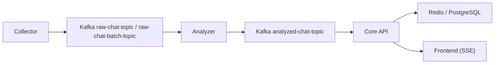
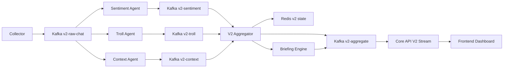

# [각(gak) v2] 구현 계획서

> 작성일: 2026-03-29  
> 목적: 기존 v1 구조를 유지하면서, 실시간 심리 가드레일 시스템 v2를 안전하게 분리 구현하기 위한 개발 기준 문서

---

## 1. 문서 목적

본 문서는 아래를 한 번에 정리하기 위한 구현 기준서다.

- 현재 프로젝트 구조와 재사용 가능한 자산
- v2 요구사항을 반영한 신규 아키텍처
- 패키지 구조, Kafka 토픽, DTO, Redis 키 설계
- 단계별 구현 순서와 작업 티켓 초안
- 테스트 및 리스크 관리 기준

핵심 원칙은 다음과 같다.

- 기존 v1 파이프라인은 유지한다.
- v2는 `com.gak.v2` 네임스페이스와 `v2-` 토픽 접두어로 완전히 분리한다.
- 초기 전달 계층은 SSE를 유지하고, 기능 안정화 후 RSocket 전환을 검토한다.

---

## 2. 현재 프로젝트 구조 요약

현재 백엔드는 이미 다음의 실시간 파이프라인을 갖고 있다.



모듈별 책임은 다음과 같다.

- `collector`
  - 채팅 수집
  - Kafka raw topic 발행
- `analyzer`
  - 감정 분석
  - 키워드/투표 관련 처리
  - Kafka analyzed topic 발행
- `core-api`
  - Redis 실시간 집계
  - DB 이력 저장
  - SSE 기반 프론트 전달
- `frontend`
  - 실시간 대시보드 렌더링

### 재사용 가능한 핵심 자산

- Kafka 기반 이벤트 파이프라인
- Redis 기반 실시간 상태 저장
- WebFlux/SSE 구독 구조
- PostgreSQL 이력 저장 구조
- Next.js 기반 대시보드 화면 골격

### 현재 구조에서 부족한 부분

- `com.gak.v2` 패키지 분리 부재
- `v2-` 토픽 체계 부재
- 병렬 Agent 구조 부재
- Trust Score / 유저 등급 엔진 부재
- Anchor Chat 클러스터링 부재
- EMA 기반 심리 완충 지표 부재
- Narrative Briefing 부재
- RSocket 전달 계층 부재

---

## 3. v2 구현 목표

v2는 단순 채팅 감정 분석이 아니라, 스트리머의 인지 부하와 부정 편향을 줄이는 심리 가드레일 시스템을 목표로 한다.

핵심 기능 목표는 다음 4개다.

1. 실시간 유저 등급제 `Trust Score`
2. 대표 맥락 추출 `Anchor Chat`
3. 심리 완충 지표 `EMA 기반 Mental Buffer`
4. 자연어 브리핑 `Narrative Briefing`

---

## 4. 구현 원칙

### 4.1 분리 원칙

- v2는 기존 v1 클래스에 로직을 섞지 않는다.
- 신규 코드는 원칙적으로 `com.gak.v2` 하위에만 작성한다.
- v2 Kafka topic은 모두 `v2-` 접두어를 사용한다.
- v1과 v2는 독립적으로 배포 및 롤백 가능해야 한다.

### 4.2 안정성 원칙

- 요약/브리핑 기능이 실패해도 핵심 채팅 전달은 유지한다.
- Trust Score나 Context Agent가 장애여도 최소한 raw sentiment 흐름은 제공한다.
- Aggregator는 부분 결과만으로도 프레임을 생성할 수 있어야 한다.

### 4.3 성능 원칙

- End-to-End 1초 미만 목표
- 채팅 처리 경로는 가능하면 메모리 기반 집계를 우선하고, Redis는 실시간 상태 캐시 중심으로 사용
- LLM/브리핑은 짧은 입력과 타임아웃을 전제로 sidecar성 컴포넌트로 설계

### 4.4 전달 계층 원칙

- 1차 구현은 SSE 기반으로 v2 이벤트 계약을 안정화한다.
- RSocket은 2차 전환 대상으로 두고, 동일 DTO/프레임을 재사용한다.

---

## 5. 목표 아키텍처



### 아키텍처 핵심 설명

- `Collector`는 v1 raw topic과 함께 `v2-raw-chat`도 병행 발행한다.
- `Sentiment Agent`, `Troll Agent`, `Context Agent`는 동일 raw 채팅을 병렬 소비한다.
- `V2 Aggregator`는 agent별 결과를 합쳐 프론트 전송용 최종 프레임을 만든다.
- `Briefing Engine`은 Aggregator 입력 또는 결과를 기반으로 자연어 브리핑을 생성한다.
- `Core API V2 Stream`은 `v2-aggregate`를 받아 SSE 또는 이후 RSocket으로 노출한다.

---

## 6. 패키지 구조

> 2026-05-18 기준 실제 구현 구조로 업데이트.

### 6.1 common

```text
backend/common/src/main/java/com/gak/v2/common/dto/
├── AnchorChat.java
├── MentalBufferState.java
├── NarrativeBriefing.java
├── UserTrustProfile.java
├── V2AggregateFrame.java
├── V2ContextResult.java
├── V2RawChatMessage.java
├── V2SentimentResult.java
└── V2TrollResult.java
```

### 6.2 collector

```text
backend/collector/src/main/java/com/gak/collector/v2/
└── producer/
    └── V2ChatProducer.java
```

매핑 로직은 `V2ChatProducer` 내부에 인라인으로 구현됨. 별도 `V2RawChatMapper` 클래스 없음.

### 6.3 analyzer

```text
backend/analyzer/src/main/java/com/gak/v2/
├── aggregate/
│   ├── V2AggregatePublisher.java
│   ├── V2Aggregator.java          ← 내부 RoomAggregateState로 상태 관리 (별도 StateStore 없음)
│   ├── V2BriefingService.java
│   └── V2EmaBufferService.java
├── bootstrap/
│   └── V2RawChatBootstrapConsumer.java  ← 디버그용 raw 이벤트 로그 컨슈머
├── context/
│   ├── V2ContextAgent.java        ← 앵커 추출·키워드 집계 인라인 구현
│   └── V2ContextPublisher.java
├── sentiment/
│   ├── V2SentimentAgent.java
│   ├── V2SentimentMapper.java
│   └── V2SentimentPublisher.java
└── troll/
    ├── TrustEvaluation.java       ← 계산 결과 Value Object
    ├── V2TrollAgent.java
    ├── V2TrollPublisher.java
    └── V2TrustScoreService.java   ← 스팸 감지 로직 인라인 포함
```

초기 계획에서 별도 클래스로 제안했던 항목 중 아래는 상위 클래스 내부에 흡수됨:

| 계획 클래스 | 실제 위치 |
|---|---|
| `V2SpamDetector` | `V2TrustScoreService.isNegative()`, `isHostile()` |
| `V2AnchorExtractor`, `V2KeywordClusterer` | `V2ContextAgent.consume()` |
| `V2AggregateStateStore` | `V2Aggregator` 내 `ConcurrentHashMap<String, RoomAggregateState>` |
| `V2VadScorer` | 미구현 — v1 `HeuristicSentimentAnalyzer` 재사용으로 대체 |

### 6.4 core-api

```text
backend/core-api/src/main/java/com/gak/
├── core_api/rag/
│   ├── HighlightEmbeddingService.java   ← 임베딩 생성 (nomic-embed-text, 768-dim)
│   └── HighlightRetrievalService.java   ← pgvector 유사도 검색 (findMostSimilarLive 추가)
└── v2/stream/
    ├── V2RedisStateService.java         ← Redis 읽기·쓰기 (계획의 redis/V2RedisService에 해당)
    ├── V2SimilarHighlightAlert.java     ← 스파이크 감지 시 프론트로 전송되는 알림 DTO
    ├── V2StreamController.java          ← /api/v2/stream/{roomId}, /api/v2/state/{roomId} 포함
    └── V2StreamService.java             ← HighlightEmbeddingService, HighlightRetrievalService 주입
```

`redis/` 패키지 대신 `stream/` 하위에 위치함. `V2StreamController`가 state 조회 엔드포인트도 함께 제공하므로 별도 `V2StatusController` 없음. `HighlightEmbeddingService`와 `HighlightRetrievalService`는 `core_api/rag/` 패키지에 위치하며 v1 VOD 하이라이트 RAG 파이프라인과 공유한다.

### 6.5 frontend

```text
frontend/src/
├── app/api/channels/[channelId]/v2/[[...v2Path]]/
│   └── route.ts                  ← /api/v2/* 프록시 라우트
├── components/v2/
│   └── V2GuardrailCard.tsx       ← EMA 지표·브리핑·앵커·키워드·신뢰 등급·유사 하이라이트 배너 통합 카드
└── hooks/
    └── useV2Stream.ts            ← SSE 구독 + 초기 스냅샷 로드 + 유사 하이라이트 알림 관리
```

`useV2Stream` 반환 시그니처: `{ frame, connected, similarAlert, dismissAlert }`

`V2GuardrailCard`는 `V2AggregateFrame` 외에 `V2SimilarHighlightAlert | null` 타입의 `similarAlert`와 `onDismissAlert` 콜백을 추가로 받는다. 알림이 있을 때 `SimilarHighlightBanner` 인라인 컴포넌트를 렌더링하며, 30초 후 자동 해제된다.

초기 계획의 5개 독립 컴포넌트(`MentalBufferBar`, `AnchorChatPanel`, `NarrativeBriefingCard`, `TrustFilterWidget`, `AudienceBalanceCard`)는 `V2GuardrailCard` 단일 파일로 통합됨. 모든 섹션이 동일한 `V2AggregateFrame`을 공유하므로 분리 이득이 없었음.

---

## 7. Kafka 토픽 설계

v2에서 사용할 권장 토픽은 다음과 같다.

| 토픽 | 역할 |
| :--- | :--- |
| `v2-raw-chat` | Collector가 발행하는 v2 원본 채팅 |
| `v2-sentiment` | 감정/VAD 분석 결과 |
| `v2-troll` | Trust Score, 유저 등급, 도배 판정 결과 |
| `v2-context` | Anchor Chat, 키워드, 토픽 맥락 결과 |
| `v2-aggregate` | 프론트 전달용 최종 집계 프레임 |
| `v2-agent-dlq` | Agent 공통 실패 적재용 선택 토픽 |
| `v2-briefing-dlq` | 브리핑 엔진 실패 적재용 선택 토픽 |

### 권장 소비 방식

- `v2-raw-chat`
  - Sentiment Agent
  - Troll Agent
  - Context Agent
- `v2-sentiment`, `v2-troll`, `v2-context`
  - Aggregator 소비
- `v2-aggregate`
  - Core API 소비

### 권장 파티션 전략

- 키는 `roomId`
- room 기준 순서를 보장하고 room 단위 집계를 단순화하기 위함

---

## 8. DTO 설계 초안

### 8.1 `V2RawChatMessage`

```text
messageId
roomId
senderId
sender
content
timestamp
messageType
userRoleCode
```

설명:

- collector가 v2로 전달하는 가장 작은 공통 입력 단위
- donation/subscription 등은 필요 시 `messageType` 분기로 확장

### 8.2 `V2SentimentResult`

```text
messageId
roomId
senderId
positiveScore
negativeScore
neutralScore
valence
arousal
emotionScores
analyzedAt
```

설명:

- 기존 7감정 점수는 유지 가능
- v2 UI와 Aggregator 계산을 위해 `positive/negative/neutral`, `valence`, `arousal`를 별도 명시

### 8.3 `V2TrollResult`

```text
messageId
roomId
senderId
trustScore
trustGrade
spamScore
isFiltered
reasons
analyzedAt
```

설명:

- 한 메시지에 대한 즉시 판정 결과
- 최종 유저 상태는 Redis `UserTrustProfile`과 함께 봄

### 8.4 `UserTrustProfile`

```text
roomId
senderId
messageCount
negativeCount
spamCount
recentJoinPenalty
trustScore
trustGrade
lastSeenAt
```

### 8.5 `AnchorChat`

```text
messageId
senderId
sender
content
weight
clusterId
```

### 8.6 `V2ContextResult`

```text
roomId
windowStart
windowEnd
anchors
keywords
topicLabel
```

### 8.7 `NarrativeBriefing`

```text
roomId
summary
confidence
generatedAt
sourceWindowStart
sourceWindowEnd
```

### 8.8 `MentalBufferState`

```text
roomId
emaPositive
emaNegative
rawPositive
rawNegative
updatedAt
```

### 8.9 `V2AggregateFrame`

```text
roomId
emittedAt
balance
mentalBuffer
trustSummary
anchors
briefing
stats
```

프론트는 초기에는 이 프레임 하나만 받아도 되도록 설계하는 것을 권장한다.

---

## 9. Redis 키 설계

실시간 상태 관리는 Redis를 중심으로 설계한다.

| 키 | 타입 | 설명 |
| :--- | :--- | :--- |
| `v2:room:{roomId}:stats` | Hash | 전체 긍정/부정/중립/필터링/총 채팅 수 |
| `v2:room:{roomId}:buffer` | Hash | EMA 상태 |
| `v2:room:{roomId}:anchors` | String or List | 최신 앵커 채팅 3~5개 |
| `v2:room:{roomId}:briefing` | String | 최신 브리핑 |
| `v2:room:{roomId}:user:{userId}` | Hash | 개별 유저 trust profile |
| `v2:room:{roomId}:window:{epoch}` | Hash | 짧은 시간 윈도우 집계 |

### 예시 필드

#### `v2:room:{roomId}:stats`

- `positiveCount`
- `negativeCount`
- `neutralCount`
- `filteredCount`
- `totalCount`

#### `v2:room:{roomId}:buffer`

- `emaPositive`
- `emaNegative`
- `rawPositive`
- `rawNegative`
- `lastUpdatedAt`

#### `v2:room:{roomId}:user:{userId}`

- `trustScore`
- `trustGrade`
- `messageCount`
- `negativeCount`
- `spamCount`
- `lastSeenAt`

---

## 10. Agent별 상세 구현 계획

## 10.1 Sentiment Agent

### 목표

- 채팅별 빠른 감정 방향성 판단
- 기존 v1 감정 분석 자산 최대 재사용

### 구현 전략

- 1차는 기존 heuristic analyzer를 래핑해 빠른 점수 계산
- 필요 시 모호한 메시지만 보강 분석
- 출력 형식은 v2 표준 DTO로 통일

### 출력

- 토픽: `v2-sentiment`
- DTO: `V2SentimentResult`

### 비고

- v1의 7감정 모델은 그대로 살리고, v2는 화면용 계산을 위해 positive/negative 축을 추가로 만든다.

## 10.2 Troll Agent

### 목표

- 유저별 Trust Score 산출
- 도배/분탕 후보를 실시간 격리

### 입력 신호

- 최근 메시지 빈도
- 반복 문장 비율
- 신규 진입 직후 강한 부정 비율
- 누적 부정 발화 비중
- 짧은 시간 내 동일 문장 도배

### 등급 정책 초안

- `FAN`
  - 구독자 또는 활동 이력이 충분하고 긍정/중립 기여가 높은 유저
- `NORMAL`
  - 신규 또는 보통 수준 유저
- `TROLL_CANDIDATE`
  - 반복적 공격성, 도배, 신규 진입 직후 강부정이 높은 유저

### 출력

- 토픽: `v2-troll`
- DTO: `V2TrollResult`

## 10.3 Context Agent

### 목표

- 빠른 채팅 흐름 속에서 대표 맥락 3~5개를 추출

### 구현 단계

#### 1차

- 임베딩 없이 키워드/문장 유사도 기반 경량 군집화
- 대표 빈도, 유사도, 최근성 기준으로 앵커 선택

#### 2차

- 문장 임베딩 기반 클러스터링
- centroid와 가장 가까운 실제 채팅을 대표로 선별

### 출력

- 토픽: `v2-context`
- DTO: `V2ContextResult`

## 10.4 Aggregator

### 목표

- 각 Agent의 결과를 하나의 프론트용 프레임으로 합성

### 책임

- room/window 기준 상태 결합
- Trust 결과 반영 후 balance 계산
- EMA 기반 완충 지표 계산
- anchor / keyword / briefing 병합
- partial result 기반 fallback 프레임 생성

### 출력

- 토픽: `v2-aggregate`
- DTO: `V2AggregateFrame`

---

## 11. EMA 기반 Mental Buffer 설계

심리 완충의 핵심은 부정 수치가 순간적으로 튀어도 화면이 급변하지 않도록 완만하게 보정하는 것이다.

### 계산식 예시

```text
emaNegative = alpha * currentNegative + (1 - alpha) * previousEmaNegative
emaPositive = alpha * currentPositive + (1 - alpha) * previousEmaPositive
```

### 권장 초기값

- `alpha = 0.2`

### 설계 의도

- 악플 스파이크가 발생해도 그래프와 요약 문구가 급격히 흔들리지 않게 함
- 스트리머가 순간 부정에 과몰입하지 않도록 완충 지대를 제공

### 프론트 노출 원칙

- raw 값과 EMA 값을 혼동하지 않도록 분리 표기
- v2 UI의 대표 값은 EMA 기반 buffer를 우선 표시

---

## 12. Narrative Briefing 설계

### 목표

- 현재 상황을 숫자 대신 자연어 1~2문장으로 브리핑

### 입력

- 최근 anchor chats
- 최근 keywords
- trust summary
- buffered sentiment
- window 단위 맥락 라벨

### 출력 예시

- `지금 시청자들은 게임 난이도에 답답함을 느끼고 있어요.`
- `부정 반응은 일부 신규 유저에 집중돼 있고, 전체 분위기는 아직 중립 이상입니다.`

### 운영 원칙

- timeout 적용
- circuit breaker 적용
- 실패 시 마지막 성공 브리핑 재사용
- 브리핑 품질이 낮으면 미표시 fallback 허용

---

## 13. Core API / 전달 계층 계획

현재 구조는 SSE 기반이고, 프론트도 이에 맞춰 동작 중이다. 따라서 1차 구현은 SSE를 유지하는 것이 적절하다.

### 1차 계획 (구현 완료)

- `V2StreamService`가 `v2-aggregate` 토픽을 소비
- `V2StreamController`가 `/api/v2/stream/{roomId}` SSE endpoint 제공
- 프론트는 v2 dashboard에서 해당 이벤트만 별도 구독

### 실제 SSE 이벤트 계약

계획 단계 권장 이벤트 목록(`v2_balance_update` 등)과 달리, 실제 구현에서는 이벤트를 2종류로 단순화했다.

| 이벤트 | 발생 조건 | 데이터 타입 |
|---|---|---|
| `v2_frame` | 매 aggregate 프레임마다 | `V2AggregateFrame` |
| `v2_similar_highlight` | 스파이크 감지 + 쿨다운 경과 + 유사도 임계치 초과 시 | `V2SimilarHighlightAlert` |
| `ping` | 15초 주기 keep-alive | `"keep-alive"` 문자열 |

### 유사 하이라이트 실시간 알림 (live highlight alert)

`V2StreamService`는 매 aggregate 프레임에서 스파이크를 감지하고, 조건을 만족하면 `v2_similar_highlight` 이벤트를 추가로 emit한다.

**스파이크 감지 기준**
- `emaPositive > 0.55` → `positive_spike`
- `emaNegative > 0.45` → `negative_spike`

**알림 발화 조건 (모두 충족해야 함)**
1. 스파이크 감지됨
2. 마지막 알림 이후 3분 경과 (`ALERT_COOLDOWN`)
3. `HighlightEmbeddingService`로 생성한 임베딩과 과거 하이라이트의 cosine 유사도 ≥ 0.72

**임베딩 텍스트 구성**
```
[LIVE] {topicLabel}
balance={balance} positive={emaPositive} negative={emaNegative}
keywords: {keywords joined}
{top anchor content}
```

### 2차 계획

- 동일한 `V2AggregateFrame`을 바탕으로 RSocket responder 추가
- 프론트 전송 계층을 점진 전환

---

## 14. 프론트 대시보드 반영 계획

현재 프론트는 실시간 대시보드 슬롯을 이미 갖고 있으므로, 전체 재작성보다 v2 카드 확장이 적절하다.

### 신규 또는 변경 컴포넌트

- `AudienceBalanceCard`
  - 전체 긍정/부정 밸런스 표시
- `MentalBufferBar`
  - EMA 기반 완충 지표 표시
- `AnchorChatPanel`
  - 대표 채팅 3~5개 노출
- `NarrativeBriefingCard`
  - 현재 상황 자연어 브리핑
- `TrustFilterWidget`
  - 격리된 메시지 수, 분탕 후보 유저 수 표시

### 최소 화면 구성안

상단:

- 민심 밸런스 바
- 현재 브리핑

중앙:

- Mental Buffer 추이 그래프
- Anchor Chat 패널

우측:

- Trust Filter 요약
- 분탕 후보/격리 수

---

## 15. 단계별 구현 로드맵

## Phase 1. v2 기반 골격 구성 ✅ 완료

작업:

- `common`에 v2 DTO 추가
- `collector`에 `V2ChatProducer` 추가
- `analyzer`에 v2 Kafka config 추가
- `core-api`에 v2 consumer/service 골격 추가
- `v2-` 토픽 생성

완료 기준:

- `v2-raw-chat`에 raw 이벤트가 안정적으로 유입됨

## Phase 2. Sentiment / Trust 구현 ✅ 완료

작업:

- Sentiment Agent 구현
- Troll Agent 구현
- Redis trust profile 반영

완료 기준:

- `v2-sentiment`, `v2-troll` 결과 생성

## Phase 3. Context / Aggregator 구현 ✅ 완료

작업:

- Anchor Chat 추출기 구현
- 키워드/맥락 집계
- Aggregator 구현
- EMA buffer 적용

완료 기준:

- `v2-aggregate` 프레임이 생성됨

## Phase 4. Dashboard 연동 ✅ 완료 (2026-05-18)

작업:

- core-api SSE endpoint 추가
- frontend v2 컴포넌트 추가
- 실시간 렌더링 검증

완료 기준:

- 실제 대시보드에서 v2 카드가 동작함

> 구현 상세는 [섹션 20](#20-phase-4-구현-기록) 참고.

## Phase 5. Briefing / 안정화

작업:

- Narrative Briefing 생성기 추가
- circuit breaker 적용
- fallback 로직 정리
- latency 측정

완료 기준:

- 브리핑 포함 end-to-end 1초 미만 목표 검증

## Phase 6. RSocket 전환 검토

작업:

- SSE 운영 결과 평가
- 필요 시 RSocket responder 추가
- 프론트 구독 전환 시범 적용

완료 기준:

- RSocket 전환 여부 확정

---

## 16. 테스트 계획

### 단위 테스트

- Trust Score 계산 규칙
- spam detector
- EMA 계산식
- anchor selection
- aggregate frame 조합

### 통합 테스트

- `v2-raw-chat -> sentiment/troll/context -> aggregate`
- Redis 상태 반영
- Core API SSE 프레임 노출

### 성능 테스트

- room별 채팅량 증가에 따른 지연 시간 측정
- target: end-to-end 1000ms 미만

### 회귀 테스트

- v1 토픽에 영향 없음
- v1 SSE/대시보드에 영향 없음
- 기존 poll/session 로직과 충돌 없음

---

## 17. 리스크 및 대응

| 리스크 | 설명 | 대응 |
| :--- | :--- | :--- |
| Anchor 추출 비용 증가 | 임베딩 기반 클러스터링은 초기 비용이 큼 | 1차는 경량 규칙 기반으로 시작 |
| Trust Score 오탐 | 정상 유저가 분탕 후보로 잘못 분류될 수 있음 | 규칙 로그 수집 및 임계치 튜닝 가능하게 설계 |
| Briefing 품질 편차 | 자연어 요약이 부정확할 수 있음 | timeout, fallback, 미표시 허용 |
| 전달 계층 과도한 변경 | 기능 개발과 RSocket 전환을 동시에 하면 복잡도 증가 | 1차는 SSE 유지 |
| v1/v2 혼재 | 기존 클래스에 v2 로직이 섞이면 유지보수 난이도 증가 | 패키지/토픽 분리 원칙 고수 |
| 실시간 임베딩 생성 지연 | 스파이크 감지 후 Ollama 임베딩 생성 → pgvector 검색 경로가 동기 I/O로 묶이면 alert 지연 또는 SSE 프레임 emit 차단 가능 | `handleSpikeDetection`은 완전 비동기(reactive chain)로 처리하고, 임베딩 실패 시 `onErrorResume(Mono.empty())`로 무음 처리하여 메인 프레임 경로에 영향을 주지 않도록 설계됨 |

---

## 18. 작업 티켓 초안

### 공통

- ✅ `GAK-V2-01` v2 DTO 추가
- ✅ `GAK-V2-02` v2 Kafka topic 설정 추가

### Collector

- ✅ `GAK-V2-03` `V2ChatProducer` 구현
- ✅ `GAK-V2-04` raw chat -> `V2RawChatMessage` 매핑 추가

### Analyzer

- ✅ `GAK-V2-05` Sentiment Agent 구현
- ✅ `GAK-V2-06` Troll Agent 구현
- ✅ `GAK-V2-07` Trust Score Redis 반영 구현
- ✅ `GAK-V2-08` Context Agent 구현
- ✅ `GAK-V2-09` Anchor Chat 추출기 구현
- ✅ `GAK-V2-10` Aggregator 구현
- ✅ `GAK-V2-11` EMA Buffer 계산기 구현
- ✅ `GAK-V2-12` Narrative Briefing 구현

### Core API

- ✅ `GAK-V2-13` `V2StreamService` 구현
- ✅ `GAK-V2-14` `/api/v2/stream/{roomId}` SSE endpoint 추가
- ✅ `GAK-V2-15` v2 상태 조회 API 추가
- ✅ `GAK-V2-25` `V2SimilarHighlightAlert` DTO 추가
- ✅ `GAK-V2-26` `V2StreamService` 스파이크 감지 + 알림 emit 추가
- ✅ `GAK-V2-27` `HighlightRetrievalService.findMostSimilarLive()` 추가

### Frontend

- ✅ `GAK-V2-16` v2 dashboard state 모델 추가 (`useV2Stream`)
- ✅ `GAK-V2-17` Mental Buffer UI 추가
- ✅ `GAK-V2-18` Anchor Chat UI 추가
- ✅ `GAK-V2-19` Narrative Briefing UI 추가
- ✅ `GAK-V2-20` Trust Filter UI 추가
- ✅ `GAK-V2-28` `v2_similar_highlight` 이벤트 구독 + `similarAlert` 상태 관리
- ✅ `GAK-V2-29` `SimilarHighlightBanner` 컴포넌트 추가 (30초 자동 해제)

### 품질

- `GAK-V2-21` 단위 테스트 추가
- `GAK-V2-22` 통합 테스트 추가
- `GAK-V2-23` latency/perf 테스트 추가
- `GAK-V2-24` v1/v2 분리 회귀 검증

---

## 20. Phase 4 구현 기록

> 작업일: 2026-05-18 / 브랜치: `feature/v2-guardrail-ui`

### 구현 파일

| 파일 | 유형 | 역할 |
|---|---|---|
| `frontend/src/hooks/useV2Stream.ts` | 신규 | SSE 구독 + 초기 스냅샷 로드 훅 |
| `frontend/src/components/v2/V2GuardrailCard.tsx` | 신규 | v2 통합 대시보드 카드 |
| `frontend/src/app/channels/[channelId]/page.tsx` | 수정 | "가드레일" 탭 추가, 훅 연결 |

### `useV2Stream` 동작 방식

```
탭 진입 (enabled=true)
    └─ GET /api/channels/{channelId}/v2/state  ← 초기 스냅샷 (Redis)
    └─ EventSource /api/channels/{channelId}/v2/stream
           └─ v2_frame 이벤트 수신 시 frame 상태 갱신
탭 이탈 (enabled=false)
    └─ EventSource.close()  ← 불필요한 SSE 연결 즉시 종료
```

탭 진입 시에만 SSE를 연결하는 방식(`enabled` 플래그)으로 서버 커넥션 낭비를 방지한다.

### `V2GuardrailCard` 구성

| 섹션 | 표시 데이터 |
|---|---|
| 헤더 | SSE 연결 상태, `topicLabel` |
| 심리 완충 지표 | `emaPositive/emaNegative` 프로그레스 바, `balance` 점수 (색상 코딩: ≥0.6 초록 / ≥0.4 노랑 / 미만 빨강) |
| AI 브리핑 | `briefing.summary` 자연어 + 신뢰도 |
| 앵커 채팅 | `anchors[]` 상위 3개, 가중치 표시 |
| 키워드 | `keywords[]` 최대 8개 칩 |
| 신뢰 등급 분포 | `trustSummary`의 FAN / NORMAL / TROLL_CANDIDATE 수 + 비율 바 |

### 계획 대비 변경 사항

계획 문서(섹션 14)는 5개 독립 컴포넌트를 제안했으나, 실제 구현에서는 `V2GuardrailCard` 단일 파일로 통합했다.

| 계획 컴포넌트 | 실제 구현 위치 |
|---|---|
| `AudienceBalanceCard` | `V2GuardrailCard` > `MentalBufferSection` |
| `MentalBufferBar` | `V2GuardrailCard` > `BarRow` |
| `AnchorChatPanel` | `V2GuardrailCard` > `AnchorSection` |
| `NarrativeBriefingCard` | `V2GuardrailCard` > `BriefingSection` |
| `TrustFilterWidget` | `V2GuardrailCard` > `KeywordsAndTrustSection` |

단일 카드로 통합한 이유: 각 섹션이 동일한 `V2AggregateFrame` 프레임을 공유하므로 props 분리가 불필요하고, 섹션별 독립 분리가 요구될 경우 추후 추출할 수 있다.

### SSE 이벤트 계약

`V2StreamService`가 emit하는 이벤트는 2종류다. 프론트 훅(`useV2Stream`)은 두 이벤트를 각각 구독한다.

```
// 매 aggregate 프레임
event: v2_frame
data: {"roomId":"abc","balance":0.62,"mentalBuffer":{...},"briefing":{...},...}

// 스파이크 감지 시 (쿨다운·유사도 조건 만족한 경우에만)
event: v2_similar_highlight
data: {"roomId":"abc","highlightId":42,"videoNo":"...","sceneLabel":"클리어 순간","category":"achievement","reasonSummary":"...","similarity":0.81,"trigger":"positive_spike","detectedAt":"2026-05-18T..."}

// 15초 주기 keep-alive
event: ping
data: keep-alive
```

### 향후 잔여 작업

- **Phase 5**: `V2BriefingService` circuit breaker 적용, end-to-end 1초 미만 검증
- **Phase 6**: RSocket 전환 여부 결정 (현재 SSE로 운영)
- **신뢰 등급 분포**: `trustSummary` 필드 키 정규화 — `V2Aggregator`가 camelCase (`fanCount`, `trollCount`, `normalCount`)로 일관되게 직렬화되면 프론트 fallback 분기(`trust_count`) 제거 가능

---

## 21. 실시간 유사 하이라이트 알림 구현 기록

> 작업일: 2026-05-18 / 브랜치: `feature/v2-live-highlight-alert`

### 배경

pgvector 인프라는 v1 VOD 하이라이트 RAG 용도로 먼저 도입됐다. v2에서 실시간 유사 하이라이트 알림을 추가함으로써 pgvector 도입의 정당성을 확보했다. SQL 레벨 유사도 검색만으로는 "라이브 채팅 패턴이 과거 어떤 하이라이트와 의미상 가장 가까운가"를 풀 수 없었기 때문이다.

### 구현 파일

| 파일 | 유형 | 역할 |
|---|---|---|
| `backend/core-api/.../v2/stream/V2SimilarHighlightAlert.java` | 신규 | 알림 DTO |
| `backend/core-api/.../v2/stream/V2StreamService.java` | 수정 | 스파이크 감지 + 알림 emit 로직 추가 |
| `backend/core-api/.../core_api/rag/HighlightRetrievalService.java` | 수정 | `findMostSimilarLive()` 메서드 추가 |
| `frontend/src/hooks/useV2Stream.ts` | 수정 | `v2_similar_highlight` 구독 + 30초 자동 해제 |
| `frontend/src/components/v2/V2GuardrailCard.tsx` | 수정 | `SimilarHighlightBanner` 컴포넌트 추가 |
| `frontend/src/app/channels/[channelId]/page.tsx` | 수정 | `similarAlert`, `dismissAlert` prop 연결 |

### 핵심 흐름

```
[매 aggregate 프레임]
    V2StreamService.consumeAggregate()
        └─ handleSpikeDetection(frame)        ← 비동기, 메인 프레임 emit과 독립
                ├─ detectSpikeTrigger()       ← emaPositive > 0.55 or emaNegative > 0.45
                ├─ 쿨다운 체크 (3분)
                ├─ HighlightEmbeddingService.requestEmbeddingPublic(text)
                └─ HighlightRetrievalService.findMostSimilarLive(roomId, vector, 0.72, trigger)
                        └─ 조건 만족 시 → sink.tryEmitNext("v2_similar_highlight", alert)

[프론트]
    useV2Stream
        ├─ v2_frame → setFrame()
        └─ v2_similar_highlight → setSimilarAlert() + 30초 후 자동 해제
```

### 설계 결정

- `handleSpikeDetection`은 완전 비동기 reactive chain으로 작성. 임베딩 실패 시 `onErrorResume(Mono.empty())`로 무음 처리하여 메인 `v2_frame` emit 경로에 영향 없음.
- 쿨다운(`lastAlertAt` Map)은 인스턴스 메모리 기반. 서버 재시작 시 리셋되나, alert은 UX 보조 기능이므로 수용 가능한 트레이드오프.
- 프론트 자동 해제 타이머(`ALERT_AUTO_DISMISS_MS = 30_000`)는 새 알림 수신 시 이전 타이머를 clearTimeout 후 재설정.

---

## 19. 결론

v2 심리 가드레일 시스템은 2026-05-18 기준으로 Phase 1~4가 모두 완료되었다.

**구현 완료 항목**

- 병렬 Agent 구조 (`V2SentimentAgent`, `V2TrollAgent`, `V2ContextAgent`)
- Redis 기반 실시간 상태 모델 + `V2Aggregator` → `v2-aggregate` 토픽
- SSE 기반 Core API 전달 계층 (`v2_frame` + `v2_similar_highlight` + `ping`)
- 프론트 대시보드 (`V2GuardrailCard` + `useV2Stream`) — 가드레일 탭으로 채널 대시보드에 통합
- pgvector 기반 실시간 유사 하이라이트 알림 — 스파이크 감지 시 과거 VOD 하이라이트와 의미 유사도 비교 후 SSE push

**잔여 항목**

- Phase 5: `V2BriefingService` circuit breaker, end-to-end latency 검증
- Phase 6: RSocket 전환 검토
- 테스트: 단위/통합/perf 테스트 (GAK-V2-21~24)
- `trustSummary` 직렬화 키 camelCase 통일

