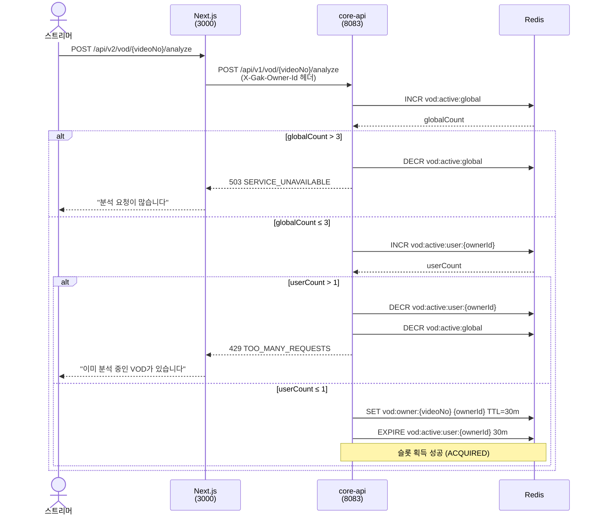
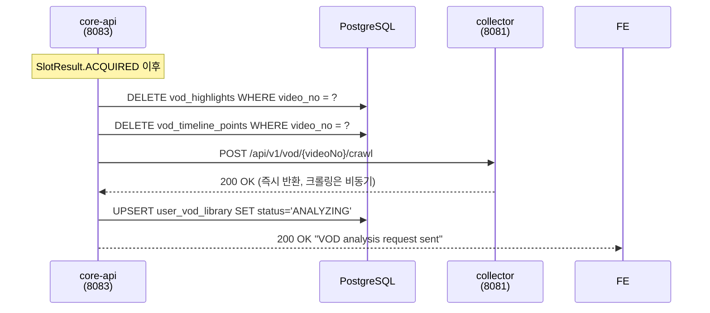
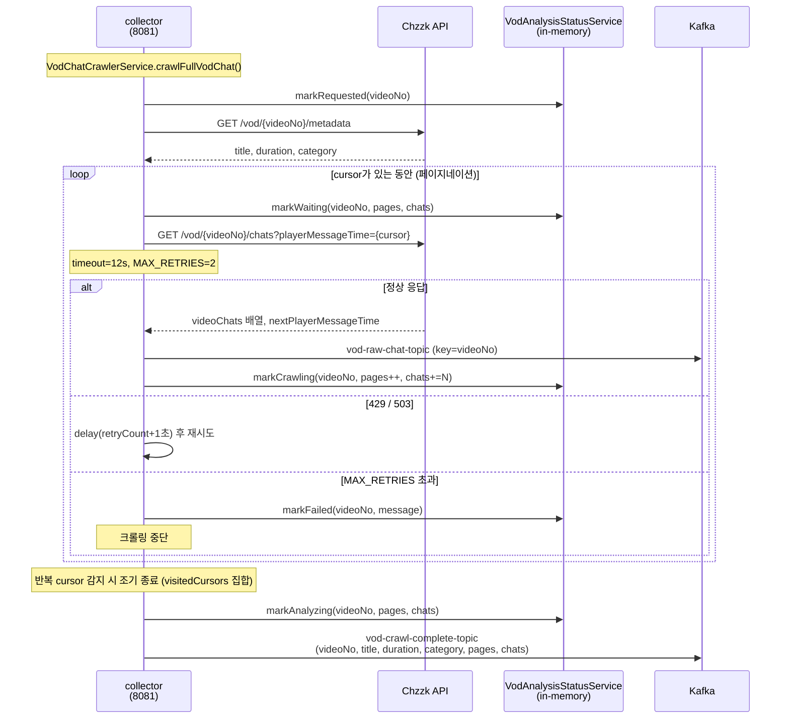
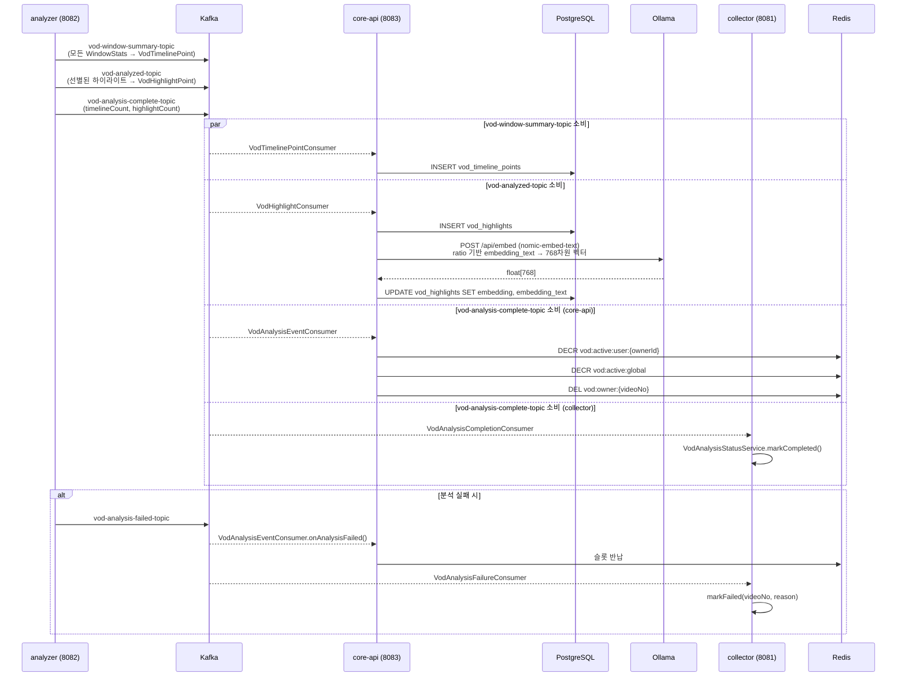
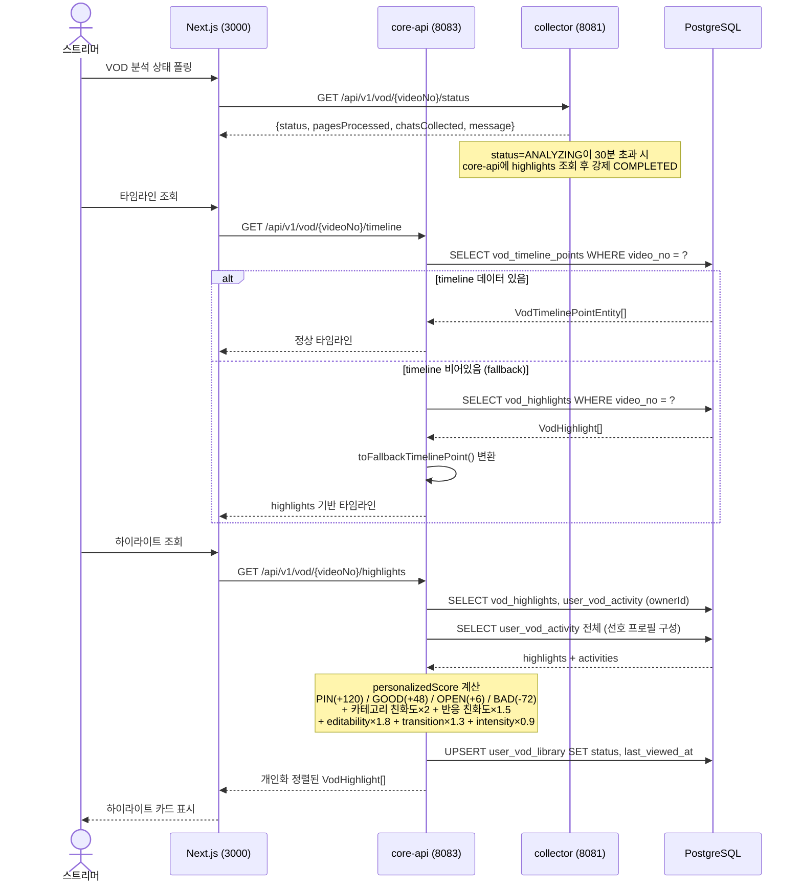

# 26. VOD 하이라이트 추출 단계별 시퀀스 다이어그램

> 구현 기준: 2026-05-17  
> 대상 파일: `VodController`, `VodAnalysisSlotService`, `VodCollectorController`, `VodChatCrawlerService`, `VodAnalysisStatusService`, `VodHighlightAnalyzer`, `OllamaAnalyzerService`, `VodHighlightConsumer`, `VodTimelinePointConsumer`, `VodAnalysisEventConsumer`, `HighlightEmbeddingService`

전체 흐름은 6단계로 나뉜다.

---

## 단계 1 — 분석 요청 및 동시성 가드레일



---

## 단계 2 — 기존 데이터 초기화 및 크롤링 시작



---

## 단계 3 — VOD 채팅 전체 크롤링



---

## 단계 4 — 하이라이트 분석 및 점수 산정

```mermaid
sequenceDiagram
    participant Kafka
    participant AZ as analyzer<br/>(8082)<br/>VodHighlightAnalyzer
    participant Ollama

    Kafka-->>AZ: vod-raw-chat-topic (청크마다)
    Note over AZ: VideoAggregate.addChat()<br/>30초 window에 채팅 적재<br/>(synchronized)

    Kafka-->>AZ: vod-crawl-complete-topic
    AZ->>AZ: scheduleFinalize(videoNo)<br/>조용한 기간 1200ms 대기

    loop 조용한 기간 확인 (최대 12회 재시도)
        AZ->>AZ: isQuietFor(1200ms)?
        alt 아직 채팅 도착 중
            AZ->>AZ: 600ms 후 재시도
        else 조용해짐
            Note over AZ: finalize 진행
        end
    end

    Note over AZ: rankWindows() — 각 30초 윈도우 점수 산정

    rect rgb(30, 40, 60)
        Note over AZ: intensityScore 구성 요소
        Note over AZ: densityScore + userScore + burstScore<br/>+ zScoreBoost + emotion 신호들<br/>(laugh/surprise/hype/tension/repetition)
        Note over AZ: transitionScore: 직전 대비 채팅 급증 + 지속 여부
        Note over AZ: editabilityScore: 다양성 + 키워드 집중도 + 대표 채팅 유무
        Note over AZ: totalScore = intensity*0.55 + transition*0.20 + editability*0.25<br/>× edgePenalty × negativePenalty
    end

    AZ->>Ollama: analyzeHighlight() — 상위 12개 후보 (concurrency=3)<br/>timeout=4분
    Ollama-->>AZ: isHighlight, intensity, category, sceneLabel, summary, reasoning

    Note over AZ: LLM 거절 → score×0.38 (hardRejected)<br/>LLM 승인 → (score+2.4)×intensityBoost

    Note over AZ: selectDistributedHighlights()<br/>버킷 분할 (4~8개 구간) → 구간별 대표 1개 먼저 선택<br/>남은 쿼터는 전역 상위로 채움<br/>최종 5~24개 하이라이트
```



---

## 단계 5 — 결과 발행 및 저장



---

## 단계 6 — 결과 조회 (개인화 포함)



---

## Kafka 토픽 흐름 요약

```
collector ──[vod-raw-chat-topic]──────────────► analyzer
collector ──[vod-crawl-complete-topic]────────► analyzer
analyzer  ──[vod-window-summary-topic]────────► core-api (VodTimelinePointConsumer)
analyzer  ──[vod-analyzed-topic]──────────────► core-api (VodHighlightConsumer)
analyzer  ──[vod-analysis-complete-topic]─────► core-api (VodAnalysisEventConsumer)
                                          └───► collector (VodAnalysisCompletionConsumer)
analyzer  ──[vod-analysis-failed-topic]──────► core-api (VodAnalysisEventConsumer)
                                         └───► collector (VodAnalysisFailureConsumer)
```

| 토픽 | 파티션 키 | 목적 |
|------|-----------|------|
| `vod-raw-chat-topic` | videoNo | 크롤링된 채팅 청크 전달 |
| `vod-crawl-complete-topic` | videoNo | 크롤링 완료 신호 |
| `vod-window-summary-topic` | videoNo | 타임라인 포인트 저장 |
| `vod-analyzed-topic` | videoNo | 하이라이트 후보 저장 |
| `vod-analysis-complete-topic` | videoNo | 슬롯 반납 + 상태 갱신 |
| `vod-analysis-failed-topic` | videoNo | 실패 처리 + 슬롯 반납 |
