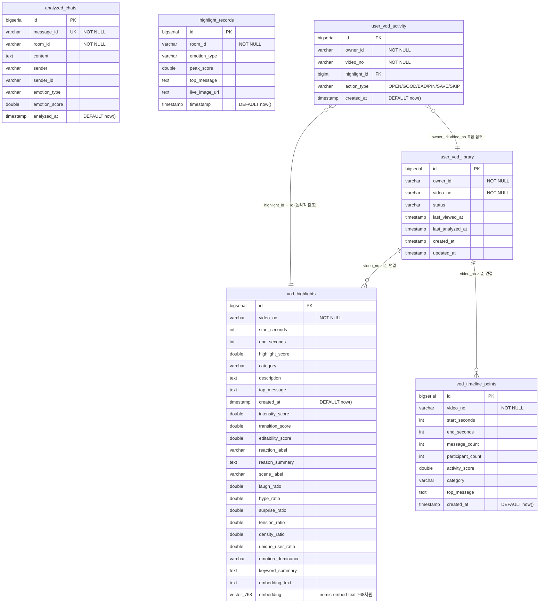

# 27. ERD (Entity Relationship Diagram)

> 구현 기준: 2026-05-17  
> 스키마 소스: `backend/core-api/src/main/resources/db/migration/V1~V7__*.sql`

---

## ERD (Mermaid)

> **참고**: R2DBC 환경에서 FK 제약은 DB 레벨에서 선언하지 않았다. 참조 무결성은 애플리케이션 레이어에서 관리한다.

---

## 테이블별 설명

### `analyzed_chats`

실시간 라이브 채팅 감정 분석 결과. Kafka `analyzed-chat-topic`에서 소비한 데이터를 저장한다. `message_id`가 중복 저장을 막는 UNIQUE 키.

| 컬럼 | 타입 | 설명 |
|------|------|------|
| `message_id` | VARCHAR | 치지직 채팅 메시지 고유 ID |
| `room_id` | VARCHAR | 방송 채널 ID |
| `emotion_type` | VARCHAR | 7가지 감정 중 하나 (기쁨/슬픔/분노/공포/혐오/놀람/중립) |
| `emotion_score` | DOUBLE | 감정 신뢰도 점수 [0.0, 1.0] |

---

### `highlight_records`

라이브 방송 중 실시간으로 감지된 하이라이트 순간. `room_id` 기준으로 가장 높은 감정 피크를 기록.

| 컬럼 | 타입 | 설명 |
|------|------|------|
| `room_id` | VARCHAR | 방송 채널 ID |
| `emotion_type` | VARCHAR | 피크 감정 유형 |
| `peak_score` | DOUBLE | 해당 시점 최고 감정 점수 |
| `live_image_url` | TEXT | 캡처 이미지 URL (선택) |

---

### `vod_highlights`

VOD 분석으로 선별된 편집 후보 구간. V3~V7 마이그레이션을 통해 점수 체계와 RAG 임베딩이 추가됐다.

| 컬럼 그룹 | 설명 |
|-----------|------|
| 기본 위치 | `video_no`, `start_seconds`, `end_seconds` |
| 점수 체계 | `highlight_score`, `intensity_score`, `transition_score`, `editability_score` |
| 레이블 | `category`, `reaction_label`, `scene_label` |
| 설명 | `description`, `reason_summary`, `top_message`, `keyword_summary` |
| 신호 비율 | `laugh/hype/surprise/tension_ratio`, `density_ratio`, `unique_user_ratio`, `emotion_dominance` |
| RAG 임베딩 | `embedding_text` (비율 기반 텍스트), `embedding` (vector 768) |

**`editability_score`** = 메시지 다양성×2.2 + 발화자 균형×1.8 + 대표 채팅×max4 + 전환점수×0.65 + 키워드 집중도×1.2 + 키워드 변화×1.4

**`totalScore`** = (intensity×0.55 + transition×0.20 + editability×0.25) × edgePenalty × negativePenalty

---

### `vod_timeline_points`

30초 윈도우 단위 채팅 활동 집계. 타임라인 시각화용. analyzer의 모든 WindowStats를 저장하므로 하이라이트보다 훨씬 많은 레코드.

| 컬럼 | 설명 |
|------|------|
| `message_count` | 해당 30초 구간 채팅 수 |
| `participant_count` | 고유 발화자 수 |
| `activity_score` | `messages×1.2 + users×2.1 + burstSignal + variety×8 + coverage×6` |
| `category` | LAUGH/WONDER/HYPE/TENSION/HOT_MOMENT |

---

### `user_vod_library`

스트리머가 조회하거나 분석한 VOD 목록. `UNIQUE(owner_id, video_no)`로 중복 방지. 상태 머신은 애플리케이션에서 관리.

| status 값 | 의미 |
|-----------|------|
| `ANALYZING` | 분석 요청 중 |
| `READY` | 분석 완료, 하이라이트 조회 가능 |
| `VIEWED` | 조회만 함 |

---

### `user_vod_activity`

하이라이트에 대한 사용자 행동 로그. 개인화 추천의 학습 데이터.

| action_type | 가중치 | 설명 |
|-------------|--------|------|
| `PIN` | +4.0 | 즐겨찾기 |
| `GOOD` / `SAVE` | +3.0 | 좋음 평가 |
| `OPEN` | +1.0 | 클릭해서 봄 |
| `BAD` / `SKIP` | -3.0 | 건너뜀 |

---

## 인덱스

| 테이블 | 인덱스 | 목적 |
|--------|--------|------|
| `analyzed_chats` | UNIQUE(`message_id`) | 중복 채팅 방지 |
| `user_vod_library` | UNIQUE(`owner_id`, `video_no`) | 1사용자 1VOD 제한 |
| `vod_highlights` | `ivfflat(embedding vector_cosine_ops, lists=100)` | 벡터 근사 검색 |

---

## 외부 의존 (DB 스키마 외)

| 데이터 | 저장 위치 | 설명 |
|--------|-----------|------|
| 세션 토큰 | Redis `gak:owner-session:{ownerId}` | HMAC 검증된 세션 |
| OAuth state | Redis `gak:auth:state:{state}` TTL=10m | CSRF 방지 |
| VOD 분석 상태 | collector 메모리 (`ConcurrentHashMap`) | 재기동 시 초기화됨 |
| 동시 슬롯 카운터 | Redis `vod:active:user:{id}`, `vod:active:global` | TTL=30m fail-open |
| VOD 메타데이터 | Chzzk API (외부) | title, duration, category |
