# 30. 시스템 신뢰성 설계

> 재시도·보안·DB 정합성·운영 관측성 관점에서 이 시스템이 어떻게 안정성을 확보했는지를 기술한다.  
> 흐름은 시퀀스 다이어그램, 구조는 클래스·상태 다이어그램으로 표현한다.  
> 구현 기준: 2026-05-17

---

## 목차

1. [재시도 및 장애 복구](#1-재시도-및-장애-복구)
2. [보안 설계](#2-보안-설계)
3. [DB 정합성 보장](#3-db-정합성-보장)
4. [LLM 신뢰 경계 관리](#4-llm-신뢰-경계-관리)
5. [운영 관측성](#5-운영-관측성)
6. [개선 전후 비교](#6-개선-전후-비교)

---

## 1. 재시도 및 장애 복구

### 1-1. VOD 채팅 크롤러 — 청크 단위 재시도

Chzzk API의 간헐적 429·타임아웃에 대응한다. 실패 시 전체 VOD가 아닌 **해당 청크부터 재시도**하므로 이미 수집된 채팅은 보존된다.

```
MAX_RETRIES = 2  |  REQUEST_TIMEOUT = 12s
재시도 대기: delay(retryCount + 1s) → 1회 실패: 1s, 2회 실패: 2s
```

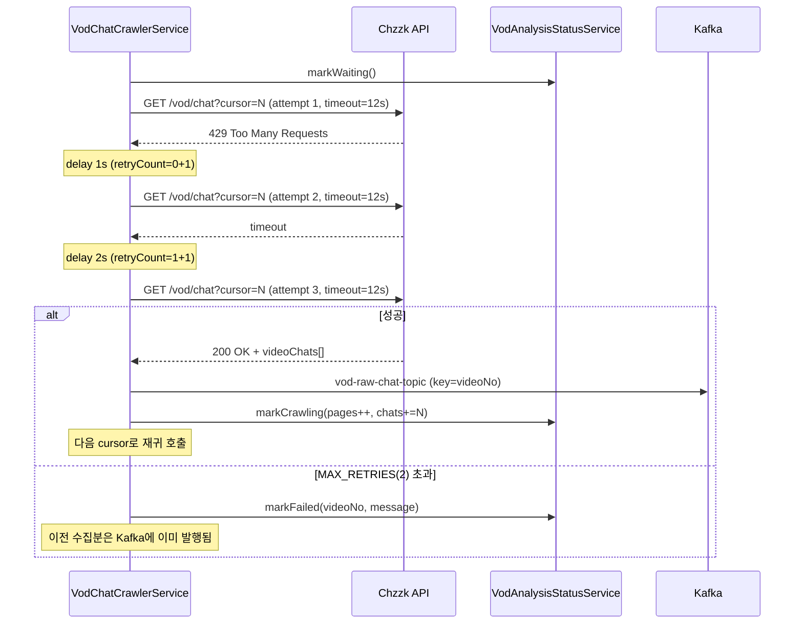
```mermaid
sequenceDiagram
    participant Crawler as VodChatCrawlerService
    participant Chzzk as Chzzk API
    participant Status as VodAnalysisStatusService
    participant Kafka

    Crawler->>Status: markWaiting()
    Crawler->>Chzzk: GET /vod/chat?cursor=N (attempt 1, timeout=12s)
    Chzzk-->>Crawler: 429 Too Many Requests

    Note over Crawler: delay 1s (retryCount=0+1)
    Crawler->>Chzzk: GET /vod/chat?cursor=N (attempt 2, timeout=12s)
    Chzzk-->>Crawler: timeout

    Note over Crawler: delay 2s (retryCount=1+1)
    Crawler->>Chzzk: GET /vod/chat?cursor=N (attempt 3, timeout=12s)

    alt 성공
        Chzzk-->>Crawler: 200 OK + videoChats[]
        Crawler->>Kafka: vod-raw-chat-topic (key=videoNo)
        Crawler->>Status: markCrawling(pages++, chats+=N)
        Note over Crawler: 다음 cursor로 재귀 호출
    else MAX_RETRIES(2) 초과
        Crawler->>Status: markFailed(videoNo, message)
        Note over Crawler: 이전 수집분은 Kafka에 이미 발행됨
    end
```

`visitedCursors` Set으로 동일 cursor 재방문을 감지해 무한 루프를 사전 차단한다.

---

### 1-2. Resilience4j Retry — Chzzk 세션 갱신

Chzzk NID 세션은 외부 OAuth API에 의존한다. 간헐적 실패에 대비한 지수 백오프 재시도가 설정되어 있다.

```yaml
# collector/src/main/resources/application.yaml
resilience4j:
  retry:
    instances:
      chzzkSession:
        max-attempts: 5
        wait-duration: 5s
        enable-exponential-backoff: true
        exponential-backoff-multiplier: 2
```

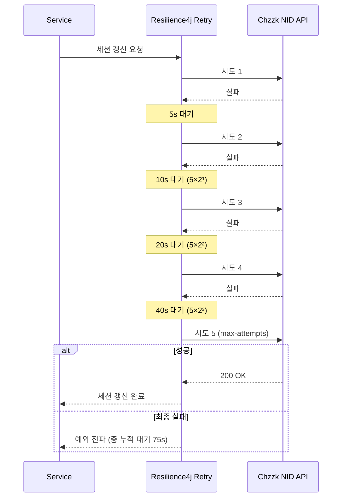
```mermaid
sequenceDiagram
    participant Service
    participant Retry as Resilience4j Retry
    participant Chzzk as Chzzk NID API

    Service->>Retry: 세션 갱신 요청
    Retry->>Chzzk: 시도 1
    Chzzk-->>Retry: 실패
    Note over Retry: 5s 대기

    Retry->>Chzzk: 시도 2
    Chzzk-->>Retry: 실패
    Note over Retry: 10s 대기 (5×2¹)

    Retry->>Chzzk: 시도 3
    Chzzk-->>Retry: 실패
    Note over Retry: 20s 대기 (5×2²)

    Retry->>Chzzk: 시도 4
    Chzzk-->>Retry: 실패
    Note over Retry: 40s 대기 (5×2³)

    Retry->>Chzzk: 시도 5 (max-attempts)
    alt 성공
        Chzzk-->>Retry: 200 OK
        Retry-->>Service: 세션 갱신 완료
    else 최종 실패
        Retry-->>Service: 예외 전파 (총 누적 대기 75s)
    end
```

---

### 1-3. Circuit Breaker — Ollama LLM

`OllamaAnalyzerService.analyzeBatch()`에 Circuit Breaker를 적용한다. Ollama 장애 시 파이프라인 전체가 블로킹되지 않고 NEUTRAL fallback으로 대체된다.

```java
@CircuitBreaker(name = "geminiApi", fallbackMethod = "fallbackAnalyzeBatch")
public Mono<List<AnalyzedChatMessage>> analyzeBatch(...) { ... }
```

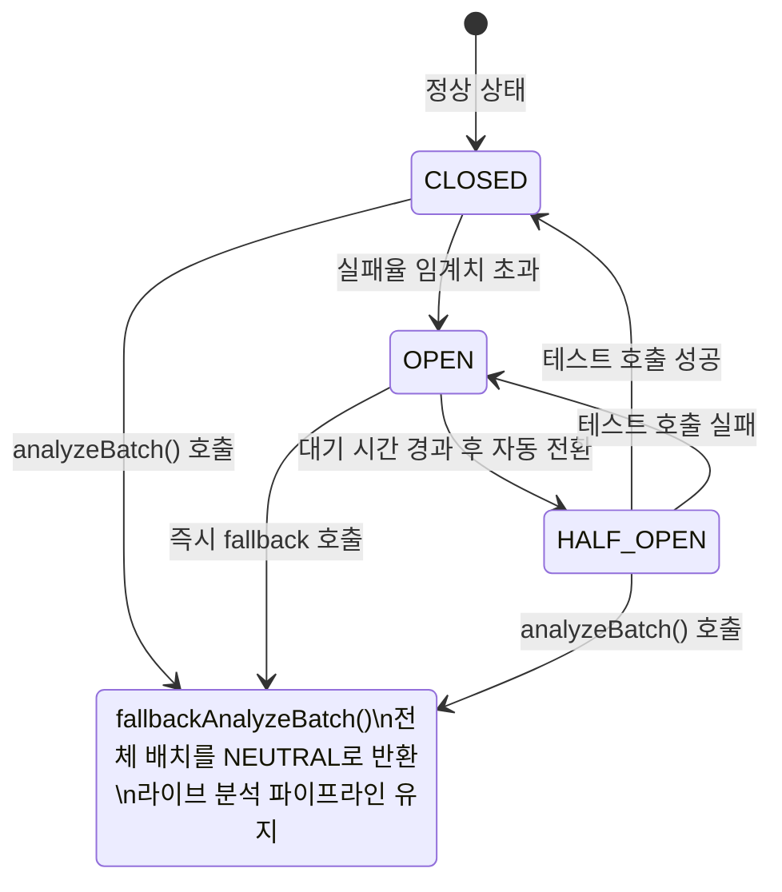
```mermaid
stateDiagram-v2
    [*] --> CLOSED : 정상 상태
    CLOSED --> OPEN : 실패율 임계치 초과
    OPEN --> HALF_OPEN : 대기 시간 경과 후 자동 전환
    HALF_OPEN --> CLOSED : 테스트 호출 성공
    HALF_OPEN --> OPEN : 테스트 호출 실패

    CLOSED --> fallback : analyzeBatch() 호출
    OPEN --> fallback : 즉시 fallback 호출
    HALF_OPEN --> fallback : analyzeBatch() 호출

    fallback : fallbackAnalyzeBatch()\n전체 배치를 NEUTRAL로 반환\n라이브 분석 파이프라인 유지
```

---

### 1-4. VOD Finalizer — 데이터 도달 대기

`vod-crawl-complete-topic`이 도착할 때 채팅 청크가 아직 Kafka 전파 중일 수 있다. Finalizer는 조용한 기간이 확보될 때까지 반복 대기한다.

```
FINALIZE_QUIET_PERIOD  = 1200ms
FINALIZE_RETRY_DELAY   = 600ms
MAX_FINALIZE_RETRIES   = 12
```

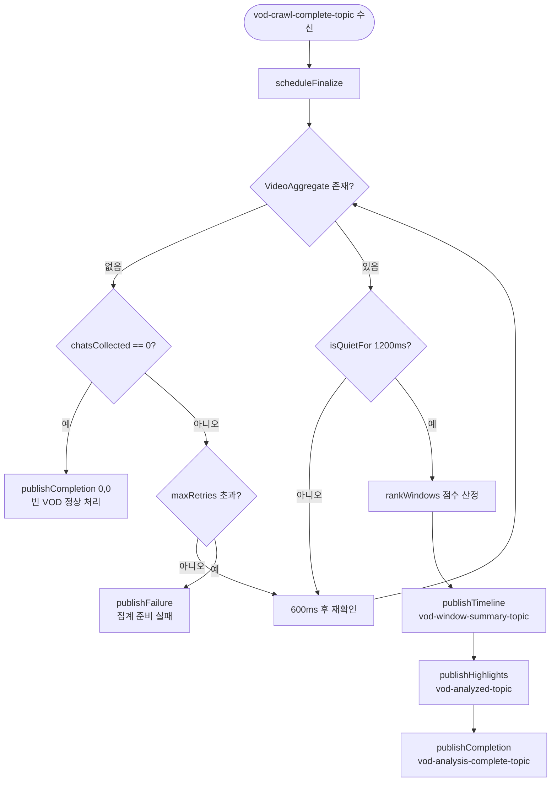
```mermaid
flowchart TD
    A([vod-crawl-complete-topic 수신]) --> B[scheduleFinalize]
    B --> C{VideoAggregate 존재?}

    C -- 없음 --> D{chatsCollected == 0?}
    D -- 예 --> E[publishCompletion 0,0\n빈 VOD 정상 처리]
    D -- 아니오 --> F{maxRetries 초과?}
    F -- 아니오 --> G[600ms 후 재확인]
    G --> C
    F -- 예 --> H[publishFailure\n집계 준비 실패]

    C -- 있음 --> I{isQuietFor 1200ms?}
    I -- 아니오 --> G
    I -- 예 --> J[rankWindows 점수 산정]
    J --> K[publishTimeline\nvod-window-summary-topic]
    K --> L[publishHighlights\nvod-analyzed-topic]
    L --> M[publishCompletion\nvod-analysis-complete-topic]
```

---

### 1-5. ANALYZING stuck 자동 보정

VOD 분석 상태는 collector의 in-memory 상태 머신에 저장된다. 재기동 시 초기화되므로 `ANALYZING`이 영구적으로 남을 수 있다.

```
STALE_ANALYZING_TIMEOUT = 30분
```

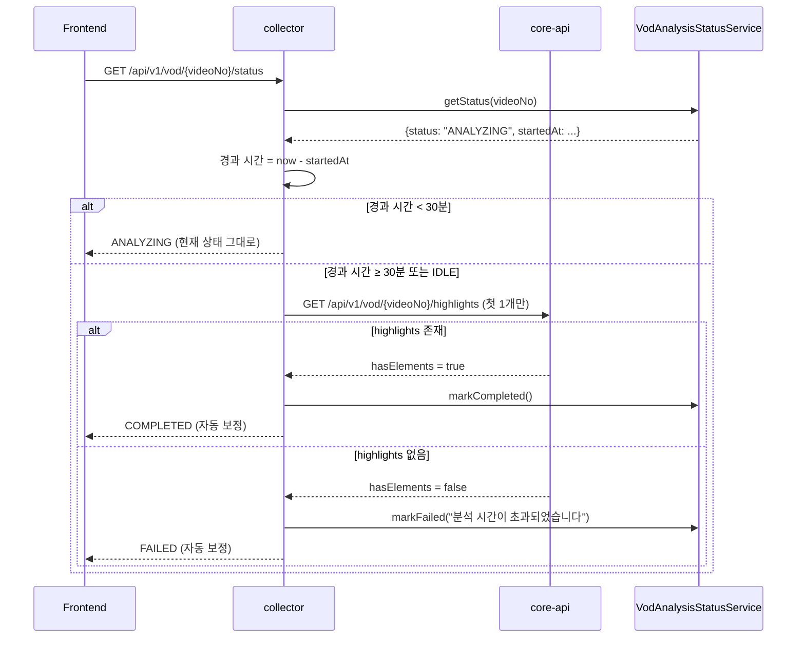
```mermaid
sequenceDiagram
    participant FE as Frontend
    participant CO as collector
    participant CA as core-api
    participant Status as VodAnalysisStatusService

    FE->>CO: GET /api/v1/vod/{videoNo}/status
    CO->>Status: getStatus(videoNo)
    Status-->>CO: {status: "ANALYZING", startedAt: ...}

    CO->>CO: 경과 시간 = now - startedAt

    alt 경과 시간 < 30분
        CO-->>FE: ANALYZING (현재 상태 그대로)
    else 경과 시간 ≥ 30분 또는 IDLE
        CO->>CA: GET /api/v1/vod/{videoNo}/highlights (첫 1개만)
        alt highlights 존재
            CA-->>CO: hasElements = true
            CO->>Status: markCompleted()
            CO-->>FE: COMPLETED (자동 보정)
        else highlights 없음
            CA-->>CO: hasElements = false
            CO->>Status: markFailed("분석 시간이 초과되었습니다")
            CO-->>FE: FAILED (자동 보정)
        end
    end
```

---

## 2. 보안 설계

### 2-1. 인증 토큰 구조

```mermaid
classDiagram
    class GAK_OWNER_ASSERTION {
        <<Cookie HttpOnly Secure>>
        +header: base64url(channelId.sessionId.expiresAt)
        +signature: HMAC-SHA256(header, GAK_COOKIE_SECRET)
        +format: header + "." + signature
    }

    class RedisSession {
        <<Redis>>
        +key: gak:owner-session:{channelId}
        +value: sessionId
        +TTL: 세션 만료 시까지
    }

    class OwnerAccessFilter {
        +verifySignature(cookie, secret)
        +validateSession(channelId, Redis)
        +checkOwnership(urlChannelId, tokenChannelId)
    }

    GAK_OWNER_ASSERTION --> OwnerAccessFilter : ① HMAC 서명 검증
    RedisSession --> OwnerAccessFilter : ② 세션 바인딩 확인
    OwnerAccessFilter --> OwnerAccessFilter : ③ channelId 소유권 확인
```

### 2-2. 3중 검증 흐름

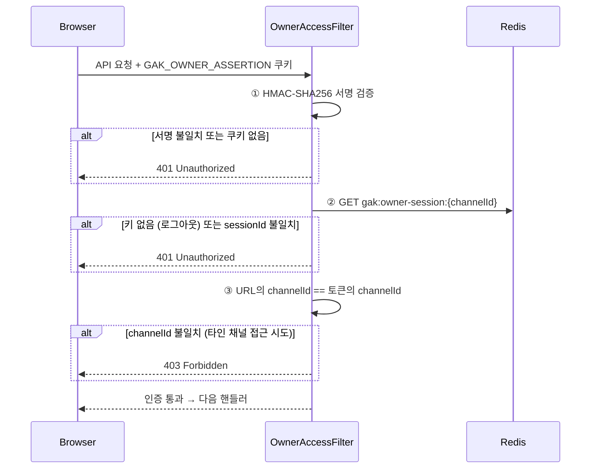
```mermaid
sequenceDiagram
    participant Browser
    participant Filter as OwnerAccessFilter
    participant Redis

    Browser->>Filter: API 요청 + GAK_OWNER_ASSERTION 쿠키

    Filter->>Filter: ① HMAC-SHA256 서명 검증
    alt 서명 불일치 또는 쿠키 없음
        Filter-->>Browser: 401 Unauthorized
    end

    Filter->>Redis: ② GET gak:owner-session:{channelId}
    alt 키 없음 (로그아웃) 또는 sessionId 불일치
        Filter-->>Browser: 401 Unauthorized
    end

    Filter->>Filter: ③ URL의 channelId == 토큰의 channelId
    alt channelId 불일치 (타인 채널 접근 시도)
        Filter-->>Browser: 403 Forbidden
    end

    Filter-->>Browser: 인증 통과 → 다음 핸들러
```

### 2-3. OAuth CSRF 방지 흐름

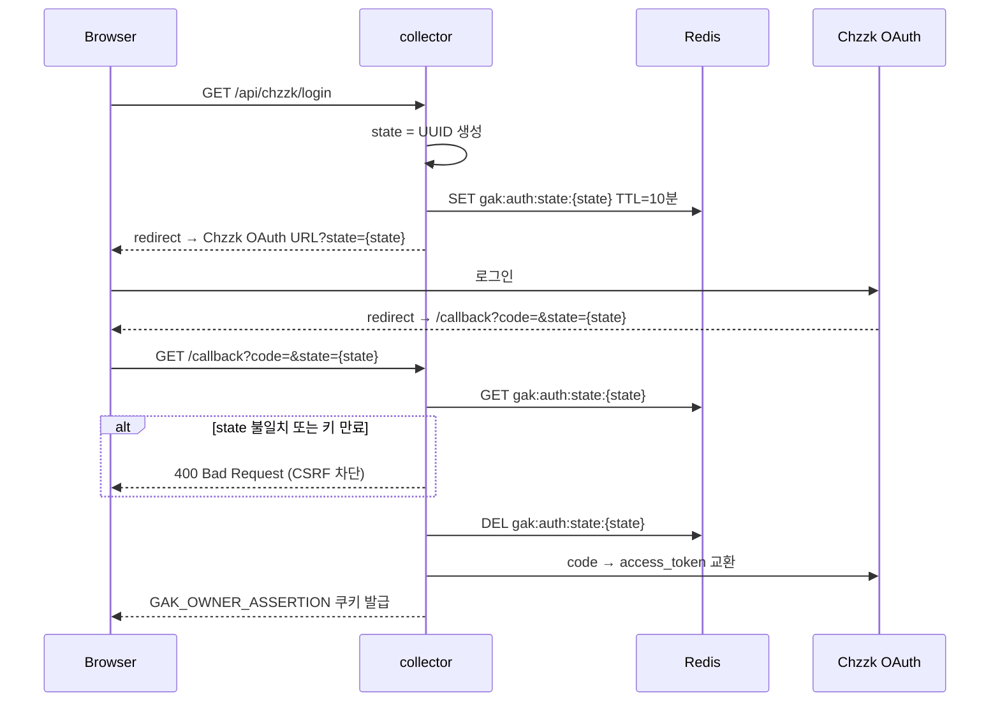
```mermaid
sequenceDiagram
    participant Browser
    participant CO as collector
    participant Redis
    participant Chzzk as Chzzk OAuth

    Browser->>CO: GET /api/chzzk/login
    CO->>CO: state = UUID 생성
    CO->>Redis: SET gak:auth:state:{state} TTL=10분
    CO-->>Browser: redirect → Chzzk OAuth URL?state={state}

    Browser->>Chzzk: 로그인
    Chzzk-->>Browser: redirect → /callback?code=&state={state}

    Browser->>CO: GET /callback?code=&state={state}
    CO->>Redis: GET gak:auth:state:{state}
    alt state 불일치 또는 키 만료
        CO-->>Browser: 400 Bad Request (CSRF 차단)
    end
    CO->>Redis: DEL gak:auth:state:{state}
    CO->>Chzzk: code → access_token 교환
    CO-->>Browser: GAK_OWNER_ASSERTION 쿠키 발급
```

### 2-4. 내부 API 보호 구조

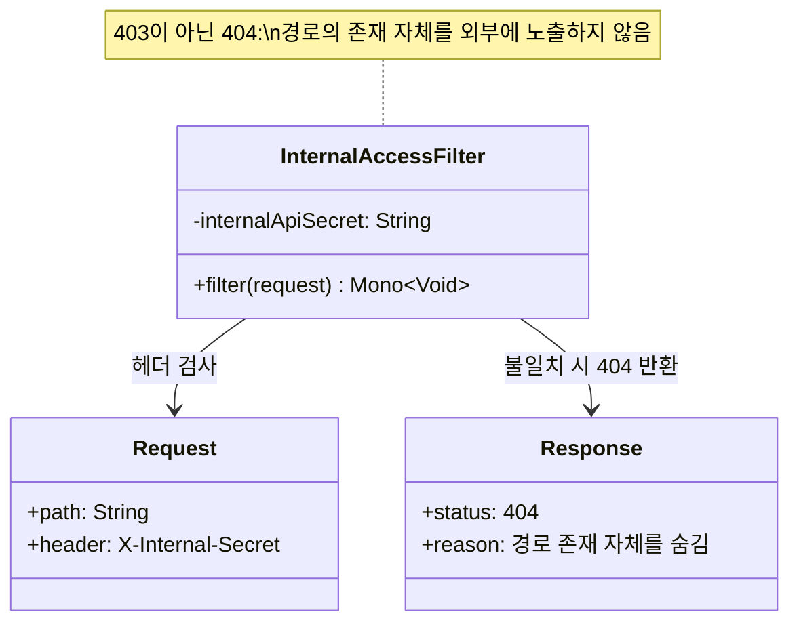
```mermaid
classDiagram
    class InternalAccessFilter {
        -internalApiSecret: String
        +filter(request) Mono~Void~
    }

    class Request {
        +path: String
        +header: X-Internal-Secret
    }

    class Response {
        +status: 404
        +reason: 경로 존재 자체를 숨김
    }

    InternalAccessFilter --> Request : 헤더 검사
    InternalAccessFilter --> Response : 불일치 시 404 반환

    note for InternalAccessFilter "403이 아닌 404:\n경로의 존재 자체를 외부에 노출하지 않음"
```

---

## 3. DB 정합성 보장

### 3-1. 계정 권한 분리 구조

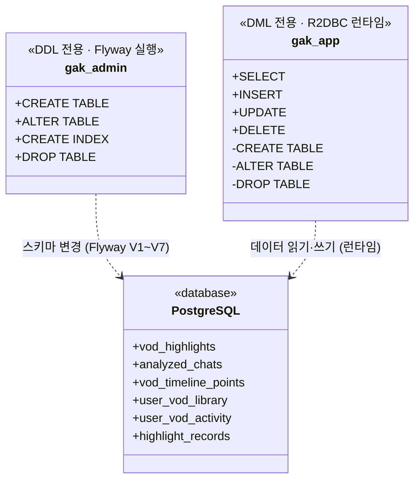
```mermaid
classDiagram
    class gak_admin {
        <<DDL 전용 · Flyway 실행>>
        +CREATE TABLE
        +ALTER TABLE
        +CREATE INDEX
        +DROP TABLE
    }

    class gak_app {
        <<DML 전용 · R2DBC 런타임>>
        +SELECT
        +INSERT
        +UPDATE
        +DELETE
        -CREATE TABLE
        -ALTER TABLE
        -DROP TABLE
    }

    class PostgreSQL {
        <<database>>
        +vod_highlights
        +analyzed_chats
        +vod_timeline_points
        +user_vod_library
        +user_vod_activity
        +highlight_records
    }

    gak_admin ..> PostgreSQL : 스키마 변경 (Flyway V1~V7)
    gak_app ..> PostgreSQL : 데이터 읽기·쓰기 (런타임)
```

런타임 계정(`gak_app`)이 DDL 권한이 없으므로 SQL Injection이 성공하더라도 스키마 변경은 불가능하다.

### 3-2. 재분석 전 클린 슬레이트 흐름

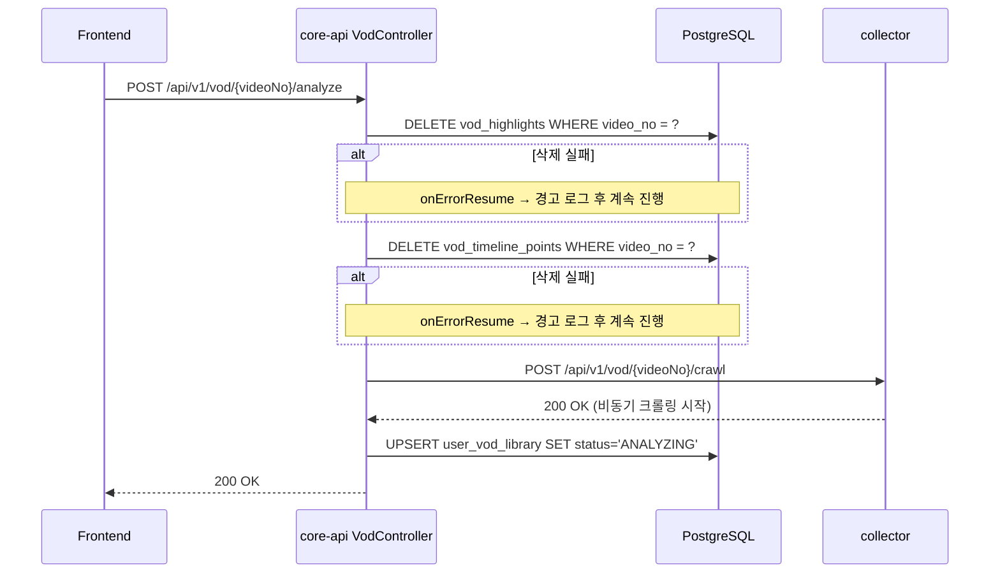
```mermaid
sequenceDiagram
    participant FE as Frontend
    participant CA as core-api VodController
    participant DB as PostgreSQL
    participant CO as collector

    FE->>CA: POST /api/v1/vod/{videoNo}/analyze

    CA->>DB: DELETE vod_highlights WHERE video_no = ?
    alt 삭제 실패
        Note over CA,DB: onErrorResume → 경고 로그 후 계속 진행
    end

    CA->>DB: DELETE vod_timeline_points WHERE video_no = ?
    alt 삭제 실패
        Note over CA,DB: onErrorResume → 경고 로그 후 계속 진행
    end

    CA->>CO: POST /api/v1/vod/{videoNo}/crawl
    CO-->>CA: 200 OK (비동기 크롤링 시작)
    CA->>DB: UPSERT user_vod_library SET status='ANALYZING'
    CA-->>FE: 200 OK
```

### 3-3. 스키마 버전 관리 구조

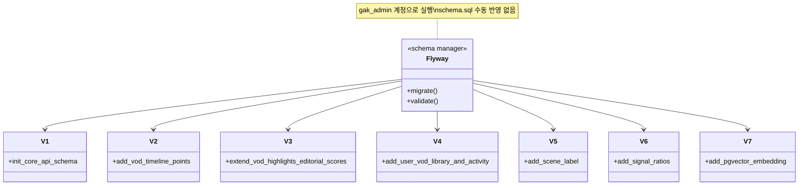
```mermaid
classDiagram
    class Flyway {
        <<schema manager>>
        +migrate()
        +validate()
    }

    class V1 { +init_core_api_schema }
    class V2 { +add_vod_timeline_points }
    class V3 { +extend_vod_highlights_editorial_scores }
    class V4 { +add_user_vod_library_and_activity }
    class V5 { +add_scene_label }
    class V6 { +add_signal_ratios }
    class V7 { +add_pgvector_embedding }

    Flyway --> V1
    Flyway --> V2
    Flyway --> V3
    Flyway --> V4
    Flyway --> V5
    Flyway --> V6
    Flyway --> V7

    note for Flyway "gak_admin 계정으로 실행\nschema.sql 수동 반영 없음"
```

---

## 4. LLM 신뢰 경계 관리

### 4-1. 감정 분석 배치 가드레일 파이프라인

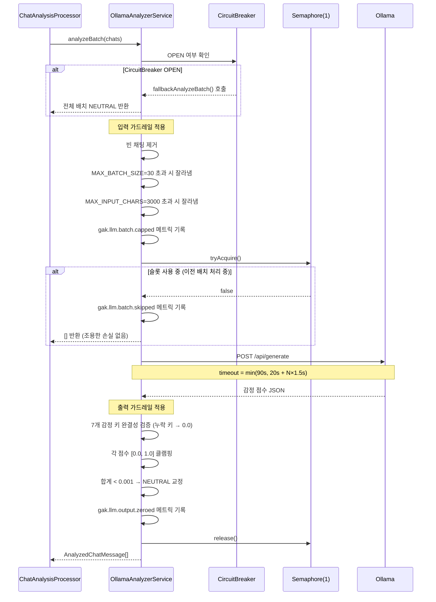
```mermaid
sequenceDiagram
    participant Listener as ChatAnalysisProcessor
    participant Guard as OllamaAnalyzerService
    participant CB as CircuitBreaker
    participant Sem as Semaphore(1)
    participant Ollama

    Listener->>Guard: analyzeBatch(chats)

    Guard->>CB: OPEN 여부 확인
    alt CircuitBreaker OPEN
        CB-->>Guard: fallbackAnalyzeBatch() 호출
        Guard-->>Listener: 전체 배치 NEUTRAL 반환
    end

    Note over Guard: 입력 가드레일 적용
    Guard->>Guard: 빈 채팅 제거
    Guard->>Guard: MAX_BATCH_SIZE=30 초과 시 잘라냄
    Guard->>Guard: MAX_INPUT_CHARS=3000 초과 시 잘라냄
    Guard->>Guard: gak.llm.batch.capped 메트릭 기록

    Guard->>Sem: tryAcquire()
    alt 슬롯 사용 중 (이전 배치 처리 중)
        Sem-->>Guard: false
        Guard->>Guard: gak.llm.batch.skipped 메트릭 기록
        Guard-->>Listener: [] 반환 (조용한 손실 없음)
    end

    Guard->>Ollama: POST /api/generate
    Note over Guard,Ollama: timeout = min(90s, 20s + N×1.5s)
    Ollama-->>Guard: 감정 점수 JSON

    Note over Guard: 출력 가드레일 적용
    Guard->>Guard: 7개 감정 키 완결성 검증 (누락 키 → 0.0)
    Guard->>Guard: 각 점수 [0.0, 1.0] 클램핑
    Guard->>Guard: 합계 < 0.001 → NEUTRAL 교정
    Guard->>Guard: gak.llm.output.zeroed 메트릭 기록

    Guard->>Sem: release()
    Guard-->>Listener: AnalyzedChatMessage[]
```

### 4-2. 배치 크기별 동적 타임아웃

```
timeout = min(90s, 20s + batchSize × 1.5s)
```

| 배치 크기 | 계산 | 타임아웃 |
|-----------|------|---------|
| 5개 | 20 + 7.5 | 27.5s |
| 15개 | 20 + 22.5 | 42.5s |
| 30개 (상한) | 20 + 45 | 65s |
| 상한 초과 시 | — | 90s (고정 상한) |

### 4-3. VOD 하이라이트 LLM 리뷰 흐름

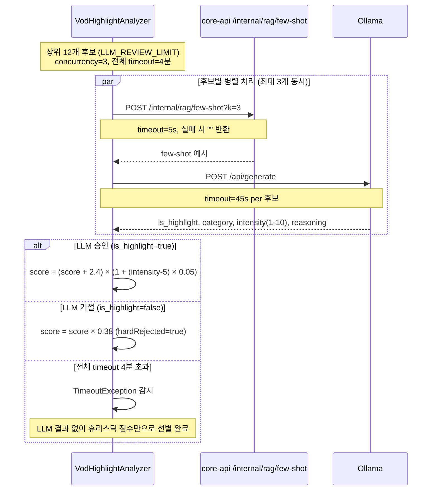
```mermaid
sequenceDiagram
    participant Analyzer as VodHighlightAnalyzer
    participant RAG as core-api /internal/rag/few-shot
    participant Ollama

    Note over Analyzer: 상위 12개 후보 (LLM_REVIEW_LIMIT)<br/>concurrency=3, 전체 timeout=4분

    par 후보별 병렬 처리 (최대 3개 동시)
        Analyzer->>RAG: POST /internal/rag/few-shot?k=3
        Note over Analyzer,RAG: timeout=5s, 실패 시 "" 반환
        RAG-->>Analyzer: few-shot 예시
        Analyzer->>Ollama: POST /api/generate
        Note over Analyzer,Ollama: timeout=45s per 후보
        Ollama-->>Analyzer: is_highlight, category, intensity(1-10), reasoning
    end

    alt LLM 승인 (is_highlight=true)
        Analyzer->>Analyzer: score = (score + 2.4) × (1 + (intensity-5) × 0.05)
    else LLM 거절 (is_highlight=false)
        Analyzer->>Analyzer: score = score × 0.38 (hardRejected=true)
    else 전체 timeout 4분 초과
        Analyzer->>Analyzer: TimeoutException 감지
        Note over Analyzer: LLM 결과 없이 휴리스틱 점수만으로 선별 완료
    end
```

LLM이 거절해도 목록에서 즉시 제거하지 않는다. `MIN_HIGHLIGHTS=5` 충족을 위한 fallback pool에 남아있다.

---

## 5. 운영 관측성

### 5-1. VOD 분석 상태 머신

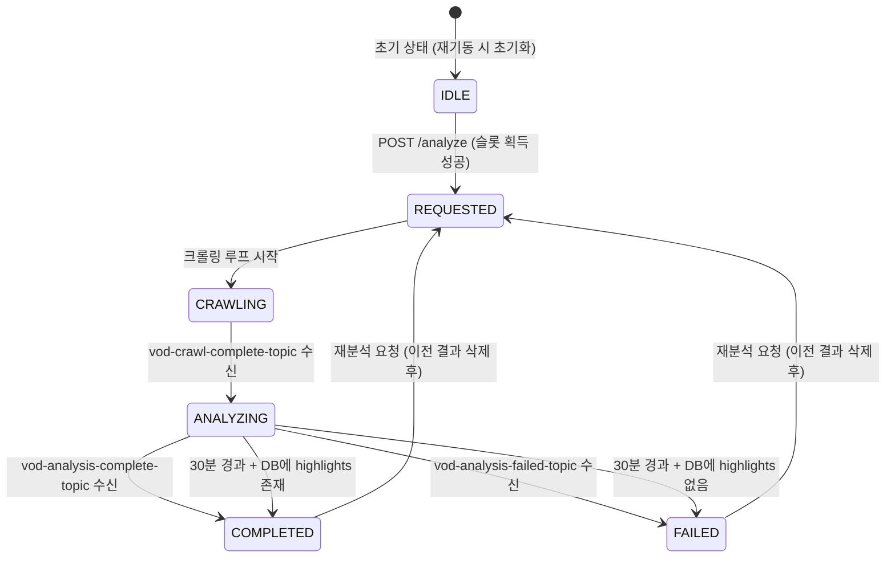
```mermaid
stateDiagram-v2
    [*] --> IDLE : 초기 상태 (재기동 시 초기화)

    IDLE --> REQUESTED : POST /analyze (슬롯 획득 성공)
    REQUESTED --> CRAWLING : 크롤링 루프 시작
    CRAWLING --> ANALYZING : vod-crawl-complete-topic 수신
    ANALYZING --> COMPLETED : vod-analysis-complete-topic 수신
    ANALYZING --> FAILED : vod-analysis-failed-topic 수신
    ANALYZING --> COMPLETED : 30분 경과 + DB에 highlights 존재
    ANALYZING --> FAILED : 30분 경과 + DB에 highlights 없음

    FAILED --> REQUESTED : 재분석 요청 (이전 결과 삭제 후)
    COMPLETED --> REQUESTED : 재분석 요청 (이전 결과 삭제 후)
```

CRAWLING 상태 중에는 `pagesProcessed`와 `chatsCollected`가 매 청크마다 갱신되어 폴링 응답에 진행률이 포함된다.

### 5-2. 메트릭 구조

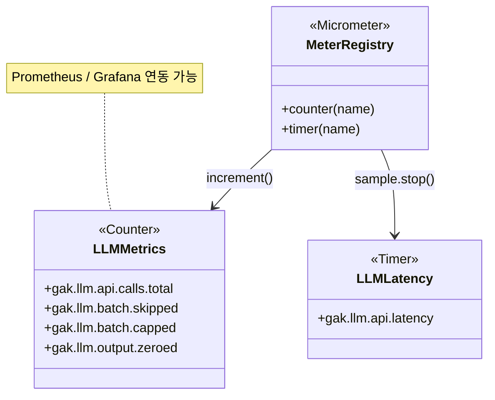
```mermaid
classDiagram
    class MeterRegistry {
        <<Micrometer>>
        +counter(name)
        +timer(name)
    }

    class LLMMetrics {
        <<Counter>>
        +gak.llm.api.calls.total
        +gak.llm.batch.skipped
        +gak.llm.batch.capped
        +gak.llm.output.zeroed
    }

    class LLMLatency {
        <<Timer>>
        +gak.llm.api.latency
    }

    MeterRegistry --> LLMMetrics : increment()
    MeterRegistry --> LLMLatency : sample.stop()

    note for LLMMetrics "Prometheus / Grafana 연동 가능"
```

### 5-3. fail-open vs fail-secure — Redis 장애 시

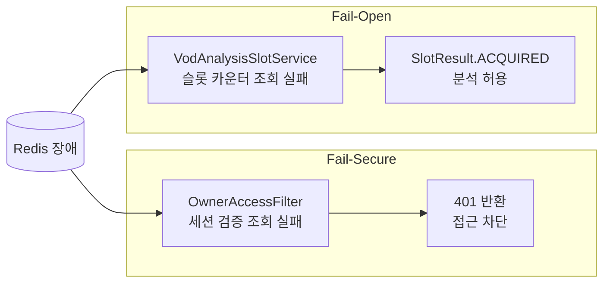
```mermaid
flowchart LR
    R[(Redis 장애)]

    subgraph FS [Fail-Secure]
        direction TB
        A1[OwnerAccessFilter\n세션 검증 조회 실패] --> A2[401 반환\n접근 차단]
    end

    subgraph FO [Fail-Open]
        direction TB
        B1[VodAnalysisSlotService\n슬롯 카운터 조회 실패] --> B2[SlotResult.ACQUIRED\n분석 허용]
    end

    R --> A1
    R --> B1
```

| 시스템 | 보호 대상 | Redis 장애 전략 |
|--------|-----------|----------------|
| `OwnerAccessFilter` | 인증 — 타인 데이터 접근 차단 | Fail-Secure (401) |
| `VodAnalysisSlotService` | 가용성 — 분석 요청 처리 | Fail-Open (허용) |

같은 Redis 의존이지만 "무엇을 지키느냐"에 따라 전략이 반대다.

---

## 6. 개선 전후 비교

### 6-1. SSE 구독 전 메시지 유실

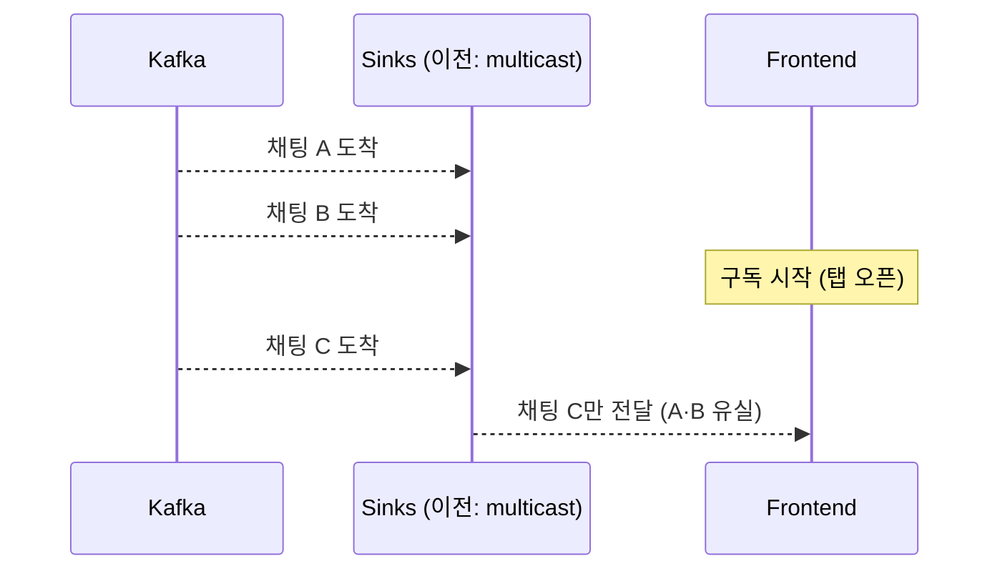
```mermaid
sequenceDiagram
    participant Kafka
    participant Sink as Sinks (이전: multicast)
    participant FE as Frontend

    Kafka-->>Sink: 채팅 A 도착
    Kafka-->>Sink: 채팅 B 도착
    Note over FE: 구독 시작 (탭 오픈)
    Kafka-->>Sink: 채팅 C 도착
    Sink-->>FE: 채팅 C만 전달 (A·B 유실)
```

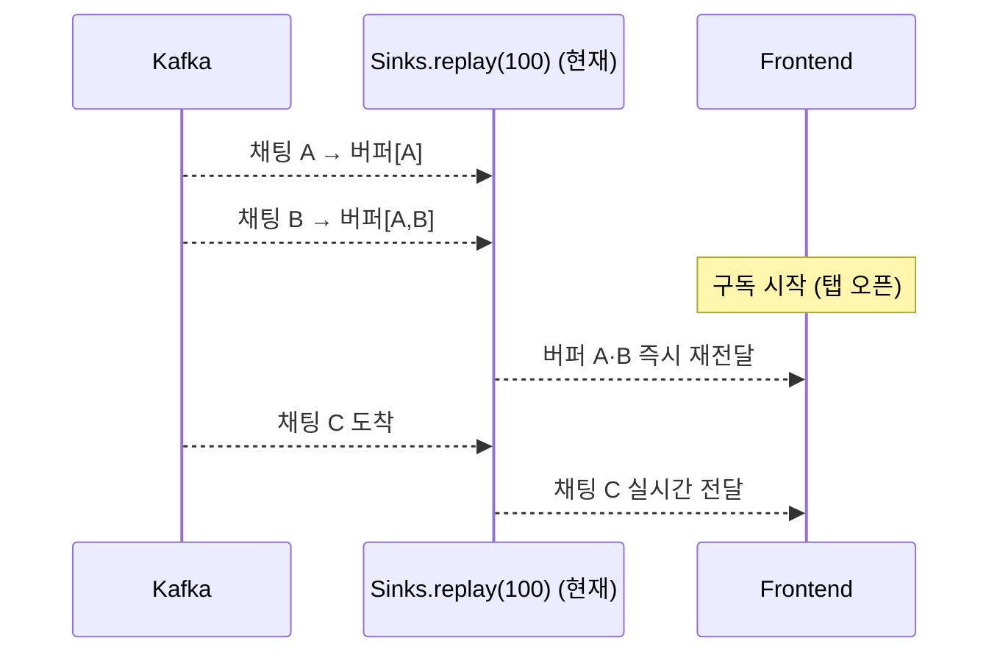
```mermaid
sequenceDiagram
    participant Kafka
    participant Sink as Sinks.replay(100) (현재)
    participant FE as Frontend

    Kafka-->>Sink: 채팅 A → 버퍼[A]
    Kafka-->>Sink: 채팅 B → 버퍼[A,B]
    Note over FE: 구독 시작 (탭 오픈)
    Sink-->>FE: 버퍼 A·B 즉시 재전달
    Kafka-->>Sink: 채팅 C 도착
    Sink-->>FE: 채팅 C 실시간 전달
```

---

### 6-2. LLM 스킵 관측 가능성

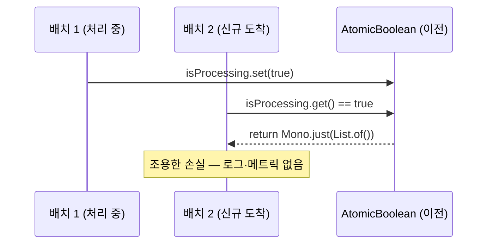
```mermaid
sequenceDiagram
    participant Batch1 as 배치 1 (처리 중)
    participant Batch2 as 배치 2 (신규 도착)
    participant Bool as AtomicBoolean (이전)

    Batch1->>Bool: isProcessing.set(true)
    Batch2->>Bool: isProcessing.get() == true
    Bool-->>Batch2: return Mono.just(List.of())
    Note over Batch2: 조용한 손실 — 로그·메트릭 없음
```

```mermaid
sequenceDiagram
    participant Batch1 as 배치 1 (처리 중)
    participant Batch2 as 배치 2 (신규 도착)
    participant Sem as Semaphore(1) (현재)
    participant Metrics as MeterRegistry

    Batch1->>Sem: acquire() 성공
    Batch2->>Sem: tryAcquire() → false
    Sem-->>Batch2: 즉시 반환
    Batch2->>Metrics: gak.llm.batch.skipped++
    Note over Batch2: 관측 가능한 스킵
```

---

### 6-3. IDOR 취약점 — 헤더 폴백 제거

```mermaid
sequenceDiagram
    participant Attacker
    participant Resolver as OwnerIdentityResolver (이전)
    participant API

    Attacker->>Resolver: 요청 (쿠키 없음)<br/>+ X-Chzzk-Owner-Id: {타인채널ID}
    Resolver->>Resolver: 쿠키 파싱 실패
    Resolver->>Resolver: 헤더 폴백 → X-Chzzk-Owner-Id 사용
    Resolver->>API: ownerId = {타인채널ID}
    API-->>Attacker: 타인 채널 데이터 반환 (IDOR 성공)
```

```mermaid
sequenceDiagram
    participant Attacker
    participant Resolver as OwnerIdentityResolver (현재)

    Attacker->>Resolver: 요청 (쿠키 없음)<br/>+ X-Chzzk-Owner-Id: {타인채널ID}
    Resolver->>Resolver: 쿠키 경로만 허용
    Resolver->>Resolver: 쿠키 없음 → null 반환
    Resolver-->>Attacker: 401 Unauthorized
    Note over Attacker: 헤더·쿼리 폴백 없음
```

---

### 6-4. VOD 하이라이트 앞쪽 쏠림 개선

```mermaid
flowchart TD
    subgraph Before [이전: 전역 상위 N개 선택]
        B1[전체 윈도우 점수 산정] --> B2[상위 N개 선택]
        B2 --> B3[결과: 초반 0~30% 구간에 집중]
    end

    subgraph After [현재: 버킷 분산 선택]
        A1[전체 윈도우 점수 산정] --> A2[시간대 버킷 분할\nbucketCount = min N, min 8, max 4]
        A2 --> A3[버킷별 대표 1개 먼저 확보]
        A3 --> A4[남은 쿼터를 전역 상위로 채움]
        A4 --> A5[결과: 전체 구간에 걸쳐 분산\nMIN=5, MAX=24]
    end
```

---

### 6-5. DB 계정 단일 → 권한 분리

```mermaid
flowchart LR
    subgraph Before [이전]
        B_App[애플리케이션] -->|DDL+DML| B_User[단일 계정\ngak_user / neul_user]
        B_User --> DB1[(PostgreSQL)]
    end

    subgraph After [현재]
        A_Flyway[Flyway] -->|DDL| A_Admin[gak_admin\nCREATE·ALTER·DROP]
        A_App[R2DBC 런타임] -->|DML| A_App2[gak_app\nSELECT·INSERT·UPDATE·DELETE]
        A_Admin --> DB2[(PostgreSQL)]
        A_App2 --> DB2
    end
```
