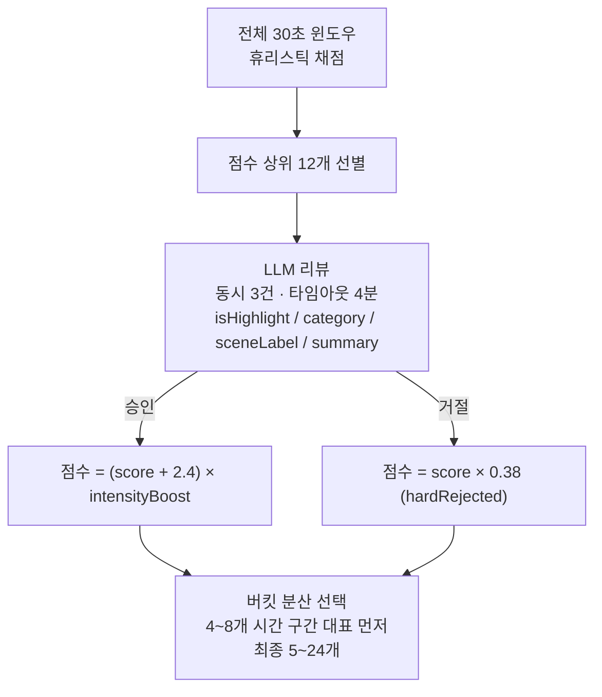
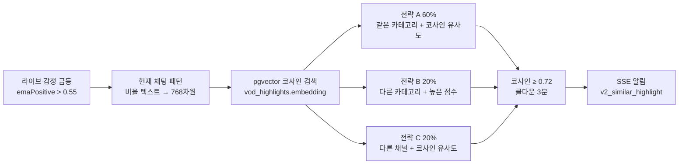
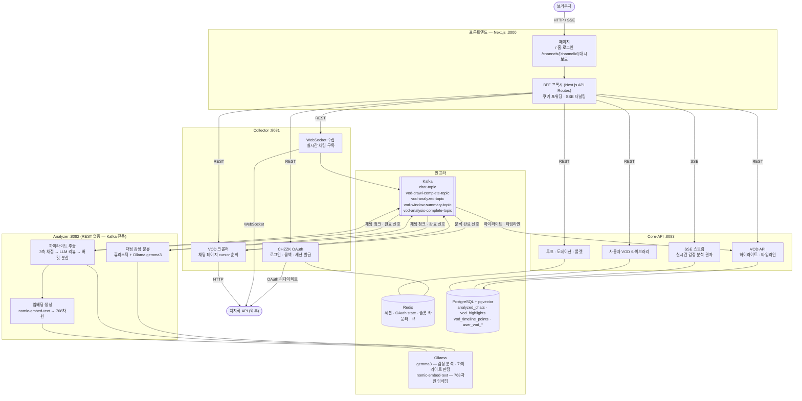
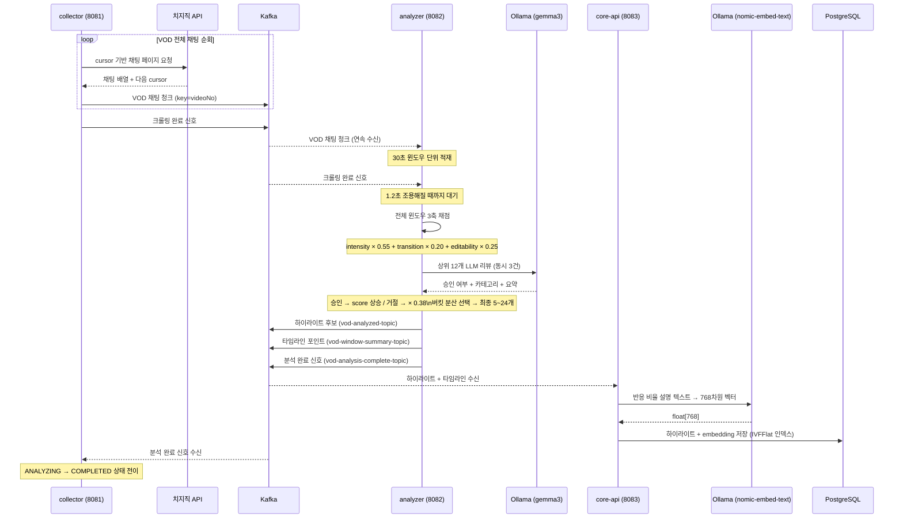

# 각(Gak) — VOD 하이라이트 추출 서비스 개요

> 작성 기준: 2026-05-18

---

## 1. 목적

방송이 끝난 뒤 스트리머가 직접 다시보기를 보며 편집 구간을 찾는 건 비효율적이다. 수만 건의 채팅이 방송 반응의 가장 밀도 높은 기록임에도 불구하고, 단순한 채팅 수 카운트만으로는 "왜 이 구간이 편집할 만한가"를 설명할 수 없다.

각은 VOD 채팅 전체를 수집해 30초 단위로 반응을 정량화하고, LLM으로 최종 편집 가치를 판단한 뒤, 그 결과를 벡터 임베딩으로 저장해 다음 라이브 방송에서 유사한 순간을 자동으로 감지하는 파이프라인이다.

---

## 2. AI를 서비스 기능으로 녹인 방식

### 2-1. 채팅 반응을 숫자로 변환하는 3축 점수

LLM이 모든 구간을 판단하면 비용과 시간이 과도하다. 전체 구간을 먼저 수치로 채점하고, LLM은 상위 후보의 최종 리뷰만 담당한다.

```
totalScore = (intensityScore × 0.55)
           + (transitionScore × 0.20)
           + (editabilityScore × 0.25)
           × edgePenalty × negativePenalty
```

| 축 | 측정 대상 | 주요 신호 |
|----|-----------|-----------|
| **intensityScore** | 반응이 얼마나 집중됐는가 | 채팅 밀도, 고유 발화자 수, 순간 폭발(burst) 신호, 웃음·놀람·하이프·긴장 비율, Z-score 통계 돌출도 |
| **transitionScore** | 직전 구간 대비 흐름이 얼마나 바뀌었는가 | 채팅 수 급증 비율, 반응 지속 여부 |
| **editabilityScore** | 실제 편집 포인트로 쓰기 좋은가 | 메시지 다양성 × 2.2, 발화자 균형 × 1.8, 대표 채팅 유무 × max4, 키워드 집중도 × 1.2, 키워드 변화 × 1.4 |

**페널티**
- `edgePenalty`: VOD 시작·끝 5분 — 앞뒤 맥락이 없어 단독으로 편집하기 어렵다.
- `negativePenalty`: 혐오·분노 채팅 비율이 높은 구간 — 편집 부적합 구간을 걸러낸다.

### 2-2. 휴리스틱 + LLM 이중 경로



**휴리스틱만 쓰면**: 채팅 수가 많아도 유행어나 비속어 반어 맥락을 모르고 편집 부적합 구간을 올린다.  
**LLM만 쓰면**: 수백 개 윈도우를 전부 보낼 경우 4분 이상 소요되고, Ollama 큐가 포화된다.  
**이중 경로**: 휴리스틱으로 후보를 12개로 좁히고 LLM은 최종 판단만 담당한다.

### 2-3. 반응 비율 기반 임베딩 텍스트

채팅 원문을 그대로 임베딩하면 특정 유행어·방언에 민감해 일반화가 어렵다. 대신 각 구간의 **반응 비율 기반 설명 텍스트**를 생성해 임베딩한다.

```
# 채팅 원문 임베딩의 문제
"ㅋㅋㅋㅋ 개웃김 ㅋㅋ 미쳤다 ㅋㅋㅋ" → 특정 표현에 과도하게 반응

# 비율 기반 설명 텍스트 (채택)
"반응 구성: 웃음 45% 하이프 30% 긴장 10% 놀람 15%
 채팅 밀도 높음, 고유 발화자 비율 68%
 카테고리: LAUGH, 장면: 게임_클러치, 감정 주도: JOY"
```

비율 텍스트는 채널·언어·유행어와 무관하게 반응의 구조적 패턴을 표현한다. 이 텍스트를 `nomic-embed-text` 모델로 768차원 벡터로 변환해 `vod_highlights.embedding` 컬럼에 저장한다.

### 2-4. 저장된 임베딩을 라이브에서 재활용하는 유사 패턴 알림

VOD에서 추출한 임베딩은 다음 라이브 방송에서 재사용된다. 라이브 중 감정 신호가 급등하면 현재 채팅 패턴을 동일한 방식으로 임베딩하고 pgvector 코사인 검색으로 과거 하이라이트와 비교한다.



---

## 3. LLM 출력 통제

LLM은 형식이 잘못된 JSON을 반환하거나, 점수 범위를 벗어나거나, 응답을 통째로 누락할 수 있다. 이를 서비스 신뢰성 문제로 다루지 않고 예측 가능한 엔지니어링 문제로 다뤘다.

### 3-1. 입력 가드레일

```
빈 채팅 제거 → 배치 크기 상한(MAX_BATCH_SIZE=30) → 총 문자 수 상한(MAX_INPUT_CHARS=3,000)
```

상한 초과 시 `gak.llm.batch.capped` 메트릭 기록. 이전에는 상한이 없어 배치가 클수록 고정 60초 타임아웃이 부족해 Circuit Breaker가 열렸다.

### 3-2. 동적 타임아웃

```
timeout = min(90, 20 + batchSize × 1.5) 초
```

배치 크기 10 → 35초, 30 → 65초, 상한 90초. 고정 60초 타임아웃은 소규모 배치에서는 과도하게 길고 대형 배치에서는 부족했다.

### 3-3. 출력 가드레일

```java
// 7개 감정 키 완결성 확인
VALID_EMOTIONS.forEach(e -> scores.putIfAbsent(e, 0.0));

// 점수 범위 강제 클램프
scores.replaceAll((k, v) -> Math.max(0.0, Math.min(1.0, v)));

// 모든 점수가 0이면 NEUTRAL로 교정
if (scores.values().stream().mapToDouble(Double::doubleValue).sum() < 0.001) {
    recordCount("gak.llm.output.zeroed");
    return EmotionResult.neutral(messageId);
}
```

### 3-4. 동시성 제어

| 계층 | 이전 | 이후 | 이유 |
|------|------|------|------|
| LLM 호출 | `AtomicBoolean`(조용히 버림) | `Semaphore(1)` | 스킵 발생을 `gak.llm.batch.skipped` 메트릭으로 관측 가능하게 전환 |
| VOD 분석 | 무제한 | Redis 카운터 (전역 3건·사용자 1건) | 여러 사용자가 동시 요청 시 Ollama 큐 포화 방지 |

```java
// AtomicBoolean → Semaphore 교체
if (!llmSlot.tryAcquire()) {
    recordCount("gak.llm.batch.skipped"); // 관측 가능한 이벤트
    return Mono.just(List.of());
}
return doAnalyzeBatch(capped)
    .doFinally(ignored -> llmSlot.release()); // 성공·실패·취소 모두 반납 보장
```

### 3-5. Circuit Breaker

Ollama가 연속 실패하면 Circuit Breaker가 `OPEN` 상태로 전환돼 이후 호출을 즉시 차단하고 `NEUTRAL` fallback을 반환한다. LLM 장애가 채팅 파이프라인 전체를 중단시키지 않는다.

### 3-6. 관측성 메트릭

| 메트릭 | 발생 조건 |
|--------|-----------|
| `gak.llm.batch.skipped` | Semaphore 슬롯 사용 중 — 배치를 스킵 |
| `gak.llm.batch.capped` | 입력 가드레일이 배치 크기·문자 수를 줄임 |
| `gak.llm.output.zeroed` | 감정 점수 합계 0 → NEUTRAL 교정 |

---

## 4. POC 검증

### 4-1. 점수 가중치 선택 근거

3축 가중치(`0.55 / 0.20 / 0.25`)는 "편집 도구"라는 목적에서 역산했다.

- **intensity 0.55**: 반응 집중도는 하이라이트의 가장 직접적인 근거다. 가중치를 낮추면 채팅이 없는 구간도 후보가 된다.
- **transition 0.20**: 흐름 전환점은 편집 시 인트로·아웃트로로 유용하지만, 단독으로 높으면 단순한 방송 중단·재개 구간이 올라온다.
- **editability 0.25**: 실제 편집 적합도다. 발화자 다양성이 없거나 대표 채팅이 없는 구간은 intensity가 높아도 편집 가치가 낮다.

초기에는 intensity 단일 기준으로 상위 N개를 뽑는 방식을 사용했다. 이 경우 반응이 가장 뜨거웠던 특정 시간대(예: 클라이맥스 구간)에 후보가 몰렸고, 방송 전반부는 아무것도 선택되지 않았다.

### 4-2. 버킷 분산 선택

단순 점수 상위 N개를 뽑으면 하이라이트가 VOD 후반부에 집중된다. VOD를 4-8개 시간 구간(버킷)으로 나눠 각 구간에서 대표 1개를 먼저 선택하고, 남은 쿼터를 전역 상위로 채운다. 결과적으로 5-24개 하이라이트가 방송 전체를 커버한다.

검증 기준 (`09_evolution_roadmap.md` 체크리스트):
- 하이라이트가 특정 시간대에만 몰리지 않는다 ✅
- 후반부에도 의미 있는 구간이 살아남는다 ✅
- 대표 채팅이 대부분 비어 있지 않다 ✅

### 4-3. 유사도 임계값 0.72

코사인 유사도 임계값은 0.72로 설정했다. 이 값 이하에서는 카테고리가 다른 구간이 유사하다고 판정되는 오탐이 많았고, 이 값 이상에서는 실제로 반응 패턴이 거의 동일한 구간만 통과했다. 3분 쿨다운은 같은 하이라이트가 연속으로 알림되는 것을 방지한다.

### 4-4. LLM 타임아웃 LLM 리뷰 실패 시 동작

LLM 리뷰가 타임아웃되면 휴리스틱 점수만으로 최소 5개 하이라이트를 발행한다. LLM 리뷰를 기다리느라 결과 자체가 나오지 않는 것보다 품질이 다소 낮더라도 결과를 제공하는 편이 낫다.

### 4-5. 단위 테스트 검증

**OllamaAnalyzerService — 9개**

| 테스트 케이스 | 검증 항목 |
|--------------|-----------|
| `analyzeBatch_Success` | 정상 응답 파싱, 감정 점수 매핑 |
| `analyzeBatch_PartialMissingResponse` | 누락 메시지 NEUTRAL fallback |
| `analyzeBatch_WithMarkdownCodeBlock` | LLM이 Markdown 코드 블록으로 감싼 JSON 파싱 |
| `analyzeBatch_WithExtraText` | JSON 앞뒤 여분 텍스트에서 JSON 추출 |
| `analyzeBatch_MalformedJson_Fallback` | 파싱 불가 응답 → 전체 NEUTRAL fallback |
| `analyzeHighlight_Success` | RAG few-shot 주입 + 하이라이트 판정 정상 파싱 |
| `analyzeHighlight_DefaultsAndClamp` | 빈 필드 기본값, intensity 1~10 범위 클램프 |
| `analyzeHighlight_BlankOrMalformed_Fallback` | 빈·손상 응답 → fallback |
| `analyzeHighlight_PromptLoadFailure_Fallback` | 프롬프트 로딩 실패 → fallback, Ollama 미호출 확인 |

**VodHighlightAnalyzer — 4개**

| 테스트 케이스 | 검증 항목 |
|--------------|-----------|
| `consumeCompletion_NormalizesUnknownEditorialCategory` | LLM이 알 수 없는 카테고리 반환 시 "소통"으로 정규화 |
| `consumeCompletion_ExcludesRejectedHighlights` | LLM 거절(`isHighlight=false`) 후보 제외 |
| `consumeCompletion_LlmReviewTimeoutFallsBackToHeuristics` | LLM 타임아웃 → 휴리스틱으로 최소 5개 발행 |
| `consumeCompletion_ComposesSceneLabelForGachaFlex` | 가챠 키워드 + 놀람 신호 조합 → `sceneLabel="비틱"` 자동 결정 |

---

## 5. 기술 스택 선택 근거

### pgvector — 별도 벡터 DB 없이 유사도 검색

Pinecone·Weaviate 같은 전용 벡터 DB를 추가하면 운영 복잡도와 데이터 동기화 부담이 올라간다. pgvector의 IVFFlat 인덱스와 코사인 거리 연산자(`<=>`)로 768차원 근사 검색을 PostgreSQL 내에서 처리해, 기존 RDBMS 스택을 유지하면서 구현했다.

```sql
-- 인덱스 (lists=100 → 벡터 수가 늘면 조정 필요)
CREATE INDEX ON vod_highlights
USING ivfflat (embedding vector_cosine_ops) WITH (lists=100);

-- 유사도 검색
SELECT * FROM vod_highlights
ORDER BY embedding <=> $queryVector
LIMIT 5;
```

### Kafka — 채팅 순서 보장과 서비스 간 결합 제거

`videoNo`를 파티션 키로 사용하면 같은 VOD의 채팅 청크가 동일 파티션에 순서대로 쌓인다. collector·analyzer·core-api가 직접 연결되지 않으므로, 하나가 재시작되어도 다른 서비스는 영향을 받지 않는다.

크롤링 완료 신호(`vod-crawl-complete-topic`)가 도착해도 채팅 청크 처리가 아직 진행 중일 수 있어, analyzer가 1.2초간 추가 채팅이 없을 때까지 대기하는 것도 Kafka의 비동기 특성에 대응한 설계다.

### Spring WebFlux — 비동기 LLM 호출 파이프라인

LLM 응답 대기(수십 초)·임베딩 생성·Kafka 소비가 모두 I/O 대기 위주다. 블로킹 스레드 방식에서는 VOD 분석 1건당 스레드가 수분간 점유된다. Reactor 기반 WebFlux로 소수 스레드가 전체 파이프라인을 비동기 처리한다. DB 저장 경로는 블로킹 드라이버를 사용해야 하는 경우 `Schedulers.boundedElastic()`을 명시해 논블로킹 이벤트 루프를 보호한다.

### Redis — 분산 동시성 제어 (fail-open)

VOD 분석은 LLM과 임베딩 서버를 동시에 점유하므로 무제한 동시 실행 시 시스템 전체가 느려진다. Redis 슬롯 카운터(전역 3건·사용자 1건, TTL 30분)로 제한하되, Redis 장애 시에는 분석 기회를 보존하기 위해 슬롯 획득을 허용(fail-open)한다. in-memory 방식(ConcurrentHashMap)은 단일 인스턴스에서만 동작하므로 수평 확장 시 동시성 보장이 불가능해 탈락했다.

```java
// Redis 장애 시 fail-open
redisService.acquireSlot(ownerId)
    .onErrorReturn(SlotResult.ACQUIRED);
```

인증 세션은 반대로 Redis 장애 시 401을 반환(fail-secure)한다. 기능의 성격에 따라 fail 기본값 방향을 다르게 적용했다.

### ChatLlmClient 인터페이스 — LLM 공급자 교체 가능 구조

`OllamaAnalyzerService`가 Ollama HTTP 포맷에 직접 의존하던 구조를 `ChatLlmClient` 인터페이스로 분리했다. 모든 가드레일(세마포어, 타임아웃, 출력 검증)은 서비스 레이어에 유지하고, HTTP 포맷은 `OllamaChatClient`에 캡슐화했다. `application.yaml` 설정만 바꾸면 Ollama → OpenAI → Claude로 교체된다.

```
ChatLlmClient (인터페이스, Port)
 └─ OllamaChatClient  ← 현재 구현체
 └─ OpenAIChatClient  ← 구현체 추가 시 서비스 코드 변경 없음
```

---

## 6. 전체 아키텍처



---

## 7. 전체 데이터 흐름


